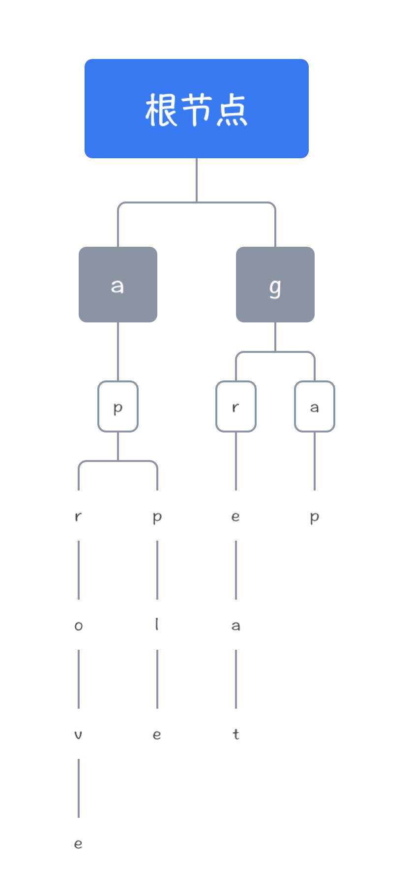

# 这个写法没前途的！要改！

划分标准按照，以下两点才是最重要的！

- 数据结构思想
- 编码技巧

<br>

# DSAPP

本文分两个方面介绍数据结构，或者说从两个视角来理解数据结构，我将学习类似于面向对象的思想来书写本文

我为其命名为DSAPP，

- 以**程序员**的角度来看待数据结构，Data Structure: A Programmer Perspective
- 以**考研狗**的角度来看到数据结构，Data Structure: A Postgraduate Perspective

<br>

## Programmer

> 当我们试图熟悉一个程序时，我认为应该从 **思想 + 技巧** 两个方面进行理解记忆
>
> 思想是对整个程序实现的抽象理解，技巧则是基于习惯的养成，产生的处理问题的套路

站在程序员的角度主要从两个方面看待我们所使用的数据结构，全文我将使用`C++`与`Python`语言进行介绍

- 一个方面是数据结构的底层是如何实现的？我将尝试仅用数组来实现众多数据结构，在这个过程中将加深对每种数据结构的每个操作的时间复杂度的记忆，并且感受算法在其中的作用。

- 另一个方面是在实际工程中我们该如何更优雅地使用这些数据结构。

<br>

## 数组表达式

在一切开始之前，我们需要理解一个概念——利用数组来表示函数关系

举个例子，函数$f(x)=3x+2$我们可以通过如下方式实现

```c++
int f[100];
for (int i = 0; i < 100; i++)
    f[i] = 3 * i + 2;
```

也就是我们通过把**因变量**的值存放在数组**自变量**对应的下标位置来构建函数关系，这时候如果我们想要$f(4)$的值只需要`f[4]`即可

同理，我们依赖数组来实现各种复杂的数据结构——树、堆、图，也离不开这样的数组表达式来帮助我们梳理数据见的逻辑关系，这个思想也是动态规划的核心思想！

**数组表达式的思想将贯穿整个数据结构学习！**

<br>

## List

链表的真正使用场景一般是不在单纯的链表上，更常见于邻接表中。

链表的优势在于动态扩容，尽管使用数组实现时实际上还是定长的。链表支持`O(1)`时间复杂度的插入，并且因为自身有序的特点十分适用于树形结构的构建，可以清楚知道节点间的从属关系。

链表的查询在除非知道每个节点的插入顺序的情况下，时间复杂度为`O(n)`的，显然链表在查询、更改以及删除上存在劣势。

在代码实现方面，链表的实现比较简单，主要是对于每个数组表示的含义以及idx索引值的理解比较重要，这些都将常见于往后的数据结构实现中。

因此我们将作出如下**约定**：

- idx：仅仅表示数据插入的先后顺序，不表示数据在链表中的位置关系
- head：头节点，初始时为-1，我们约定-1为链表结尾

- e[k]：第k个插入的节点的数值
- ne[k]：第k个插入的节点的下一个节点

这里需要特别理解的是`k`也就是`idx`这个索引，在更多的情况下我们拿到链表后并不知道每个节点的插入顺序，因此我们对于这个k实际上是未知的，获取的方式只能通过`O(n)`的遍历链表获取。

<br>

### 代码实现

```c++
using namespace std;

const int N = 100010;

int head = -1, e[N], ne[N], idx;

// 查找，返回节点索引，不存在返回-1
int find(int x)
{
  	for (int i = head; i != -1; i = ne[i])
      	if (e[i] == x)
        {
          	return i;
        }
 		return -1;
}

// 插入，在节点索引k后插入一个数据，如果k为0则使用头插法
void push(int k, int x)
{
    if (!k) 
    {
        e[++idx] = x;
        ne[idx] = head;
        head = idx;
    }
    else 
    {
        e[++idx] = x;
        ne[idx] = ne[k];
        ne[k] = idx;
    }
}

// 删除
void pop(int k)
{
    if (!k && head != -1) head = ne[head];
    else if (ne[k] != -1) ne[k] = ne[ne[k]];
}
```

<br>

### 容器

在工程实践中我们未必会手写哈希表，正如我们不会试图在项目中手写红黑树一样。

接下来我会使用`c++`的STL容器和`python`自带的哈希表来进行介绍：

```c++
// c++
#include <vector>

using namespace std;

int main()
{
  	// 初始化
    vector<int> a;

    // 插入数据
    a.push_back(x);

    /* 查询
    查询第一个元素
    查询最后一个元素
    索引查询
    */
    cout << a.front() << endl;
    cout << a.back() << endl;
    cout << a[0] << endl;

    // 弹出最后一个数据
    a.pop_back();

    // 迭代器
    for (auto i = a.begin(); i != a.end(); i ++) cout << *i << ' ';
  
  	return 0;
}
```

<br>

## DoubleList

双端链表，基于代码实现来讲时间复杂度还是客观的，和链表无异

双端链表的优势在于可以快速找到某个节点的前后节点。双端链表克服了链表中如果我想要删除节点A，我必须找到节点A的前一个节点B。双端链表可以直接指定删除A，而无需大费周章地找到前一个节点。

**删除**操作的优势，可以说是双端链表和链表最本质的区别了。

为了更优雅地实现代码，我们做出如下**约定**：

- idx：仅仅表示数据插入的先后顺序，不表示数据在链表中的位置关系
- 头节点为`idx == 0`，尾节点为`idx == 1`，不再另外设置头节点变量，也要注意节点从`2`开始

- e[k]：第k个插入的节点的数值
- l[k]：第k个插入的节点的前一个节点
- r[k]：第k个插入的节点的后一个节点

<br>

### 代码实现

```c++
using namespace std;

const int N = 100010;

int e[N], l[N], r[N], idx;

// 初始化
void init()
{
  	r[0] = 1, l[1] = 0;
    idx = 2;
}

// 在第k个节点后插入数值为x的节点
void push(int k, int x)
{
    e[idx] = x;
    l[idx] = k, r[idx] = r[k];
    l[r[k]] = idx, r[k] = idx++;
}

// 删除第k个节点
void pop(int k)
{
    l[r[k]] = l[k], r[l[k]] = r[k];
}
```

<br>

### 容器

有一说一其实双端链表这个容器实在不常用呀！

```c++
// c++
#include <list>

using namespace std;

int main()
{
  	// 初始化
  	list<int> lst;
  
  	// 插入，头插法与尾插法
  	lst.push_front(x);
  	lst.push_back(x);
  
  	/* 
  	插入，在指点迭代器前面插入
  	指定的迭代器怎么来？遍历一遍自己找
  	*/
  	lst.insert(it, x);
  
  	// 遍历
    for (auto i = lst.begin(); i != lst.end(); i ++) cout << *i << ' ';
  
  	// 删除
  	lst.erase(it);
  
  	return 0;
}
```

<br>

## Stack

栈，按照先进先出的规则约定的数据结构

但是按照这种规则我们可以延伸出牛逼的**单调栈**

使用数组实现栈也极其简易，因为我们只需要维护栈顶即可，每个操作都只需要一行即可

我们做出如下约定：

- stack：栈数组
- tt：栈顶，为空时指向0

<br>

### 代码实现

```c++
using namespace std;

const int N = 100010;

int stack[N], tt;

bool empty()
{
  	return tt ? false : true;
}

void push(int x)
{
   stack[++tt] = x;
}

int top()
{
  	return stack[tt];
}

void push()
{
  	tt--;
}
```

不介绍各语言关于栈的容器，因为完全可以使用数组模拟！而且几乎每个操作的语句都只有一行！使用容器将会导致额外的开销。

<br>

### 单调栈

单调栈按照约定不同，以及带来的功能不同分为两类：

- 单调递增栈
  - 栈内元素按照严格的单调递增约定存放
  - 利用单调递增栈可以快速找到每个元素距离其最近的比它小的元素
- 单调递减栈
  - 栈内元素按照严格的单调递减约定存放
  - 利用单调递减栈可以快速找到每个元素距离其最近的比它大的元素

单调栈各语言并未提供容器，只能自己实现，而且因为单调栈的使用特点，除非自己编写否则也发挥不出单调栈的妙用。

首先要明确，我们的单调栈对于每一个元素都来者不拒哪怕这意味着要弹出栈内原本的成员。

**我们考虑单调递增栈出栈时的情况：当一个元素出现时（我们称它为X）拿X和栈顶元素（我们称它为P）比较，如果P比A大那么意味着P将会被单调栈弹出——栈的规则是先进后出；X必须入栈；栈内所有元素必须为递增的。那么X就为P右边最近的比它小的元素，当P出栈后此时栈顶元素（我们称它为T）便是P左边最近的比它小的元素。**

按照上述规则，每当一个元素出栈时（除非是栈底元素）我们都可以知道距离它左右两边最近的比它小的元素的信息。

同理可得单调递减栈的性质，此处不再赘述。

#### 代码实现

```c++
#include <iostream>

using namespace std;

const int N = 100010;

int stack[N], tt;

int main()
{
    // 插入x，将 >= 换成 <= 即为单调递减栈
    while (tt && stack[tt] >= x)
    {
        printf("小于%d右边最近元素：%d", stack[tt], x);
        int pop = stack[tt--];
        if (tt)	printf(" 小于%d左边最近：%d", pop, stack[tt]);
        puts("");
    }
    stack[++tt] = x;
  
 		return 0;
}
```

<br>

## Queue

队列，按照先进后出的特殊规则约定的数据结构

代码实现也并不复杂，我们做出如下约定：

- q：队列数组
- hh：队头，默认为0
- tt：队尾，默认为-1，便于判断队列是否为空

<br>

### 代码实现

```c++
using namespace std;

const int N = 100010;

int q[N], hh, tt = -1;

bool empty()
{
		return tt < hh ? true : false;
}

void push(int x)
{
  	q[++tt] = x;
}

int front()
{
  	if (!empty) return q[hh];
  	else return -1;
}

int back()
{
  	if (!empty) return q[tt];
  	else return -1;
}

void pop()
{
  	hh++;
}
```

不介绍各语言关于栈的容器，因为完全可以使用数组模拟！而且几乎每个操作的语句都只有一行！使用容器将会导致额外的开销。

<br>

### 单调队列

队列内部具有单调性的特殊数据结构，说实话我觉得它并不能算是“队列”，单调队列并不遵循先进先出的原则！

其实这很好理解，我们的新元素必然加入到数组的末尾，想要让数组内的元素具备单调性唯一的方法只能通过单调栈的形式实现，即将破坏了单调性的数据弹出，再将新的符合单调性的元素加入。

**因此可以把单调“队列”理解成栈底可弹出的单调栈即可。**

这种特殊的数据结构带来的功能确实蛮不错的：

- 单调递增队列
  - 维护一个滑动窗口，窗口内部的元素具备单调递增的规律
  - 快速找到窗口内的最小值
- 单调递减队列
  - 维护一个滑动窗口，窗口内部的元素具有单调递减的规律
  - 快速找到窗口内的最大值

<br>

#### 代码实现

```c++
#include <vector>

using namespace std;

const int N = 100010;

int q[N], hh, tt = -1;

/* 
函数返回数组nums内每k个数的最小值
使用单调递增队列实现
单调队列中存放nums的索引，但是单调队列中元素的顺序则按照索引代表的值的单调递增关系进行存放
*/
vector<int> min_in_nums(vector<int> nums, int k)
{
  	vector<int> ans;
  	int n = nums.size();
  	for (int i = 0; i < n; i ++)
    {
      	// 如果单调队列中的队头小于窗口的左边界则队首向右移动
      	if (hh <= tt && q[i] < i - k + 1) hh ++;
      	// 将此处a[q[tt]] >= a[i]的 >= 换成 <= 即单调递减队列
      	while (hh <= tt && a[q[tt]] >= a[i]) tt --;
      	q[++tt] = i;
      	if (i >= k - 1) ans.push_back(a[q[hh]]);
    }
  
  	return ans;
}
```

<br>

## KMP

字符串，字符串这个数据结构并不值得大费口舌，但是字符串匹配就是一个知名的难题了——kmp算法！

首先先总结一下kmp有多强：将一个`O(n * m)`复杂度的匹配压缩到`O(n + m)`（尽管后面会介绍更强大的字符串匹配算法“字符串哈希”）

其次是kmp可以做什么：通过预处理的方式快速判断某个字符串是不是另一个字符串的子串。

### 思想

#### 寻找规律

在暴力做法中需要O(n²)的时间复杂度，但如果我们能找到模版串自身的规律则可以很大程度避免重复的匹配，降低时间复杂度。

观察模版串，此时主串指针在*9*模版串在*5*，两者字符并不匹配，在暴力做法中我们每次都将模版串的指针移向开头，但对于某些我们已经匹配过了的字符，我们是否可以像*dp*那样将经过记录下来，避免重复计算？

```
主串	
123456789
----cacac------
    cacag-
    123456
模版串    
```

观察上面的例子，两个字符串下标从一开始，模版串的前四个字符与主串一致，但在第五个字符开始与主串不一样，此时暴力做法中我们不得不将主串的指针移动到**起始位置的后一位6**而模版串的指针回到**起始位置1**。

#### 优化寻址

但是我们可以很明显地观察到，我们完全可以**不改变**主串的指针*9*，将模版串指针定位到*3*的位置继续进行匹配计算。

```
主串	
123456789
----cacac------
      cacag-
      123456
模版串   
```

观察这个例子的规律，我们不难发现，模版串[1:3]和模版串[3:5]以及主串[7:9]是一样的。

这是因为模版串本身存在着相同的子串，而主串中存在着相同子串，使得我们的指针可以移动得快一些。

#### 设计算法

> 接下来会比较绕

发现了这个规律我们意识到，如果模版串中以**某个点结尾的子串**（称为串A）与**相同长度的前缀**（称为串B）相等，那么如果串A的下一个点与主串匹配失败，则可以将模版串的指针移动至串B下一个位置——*因为串A与串B相同，而串A已经匹配过了，意味着模版串无需移动到其实位置，而是直接跳过具有相同子串的前缀即可！*

<br>

### 代码

首先我们思考核心代码，*kmp*的中心思想是**匹配失败时**模版串的指针无需每次都回到起始位置，而是利用模版串本身的特点定位到距离当前位置更近的位置即可（降低时间复杂度）。

#### Next数组

我们作出如下约定，`ne[j] = i`，该数据表示以坐标`j`结尾长度为`i`的子串与长度为`i`的前缀相同

#### 匹配失败

假如模版串下标`j`匹配失败时，我们应该将模版串指针移动到`ne[j - 1]`的下一个位置进行匹配。因此为了编码方便，我们统一约定使用`模版串[j + 1]`与主串匹配，这样当我们匹配失败时只需要`j = ne[j]`即可，匹配代码如下：

```cpp
// 主串为s，模版串为p
// 主串使用i下标，模版串使用j下标
// 主串长度为n，模版串长度为m
for (int i = 1, j = 0; i <= n; i ++)
{
  /*
  匹配失败：
  模版串指针在起始位置，起始位置无法再向前移动了
  模版串指针的下一位与主串当前指针所在位置不匹配
  */
  while (j && p[j + 1] != s[i]) j = ne[j];
  // 匹配成功只需要让模版串指针移动一位即可，主串也将移动一位
  if (p[j + 1] == s[i]) j ++;
  // 如果模版串移动到结尾则表示与主串匹配成功
  if (j == m) printf("匹配成功！");
}
```

#### 生成Next数组

next数组的生成与匹配过程基本一致，可以把主串理解成模版串本身，**ne[i] = j 表示的是以 i 结尾长度为 j 的子串与长度为 j的前缀相同**，所以说可以把*kmp*算法理解成两个匹配字符串的过程，但有意思的是在这种匹配方式下，时间复杂度为O(n)。

```cpp
// 模版串下标从1开始，而起始位置不具有可以匹配的前缀，所以从2开始匹配
for (int i = 2, j = 0; i <= m; i ++)
{
  while (j && p[j + 1] != p[i]) j = ne[j];
  if (p[j + 1] == p[i]) j ++;
  ne[i] = j;
}
```

<br>

## Trie

字典树，**记录**和**查找**有序序列的强大数据结构！

字典树是什么？比如说我们有二十个单词组成的集合，有五个单词的前缀是**ex**，有五个单词前缀是**per**，有十个单词前缀是**fore**。此时我们想要检索一个单词是否存在这个集合内，而这个单词的前缀是**pro**，很显然我们根据前缀立马就能给出否定的答案。

我们思考按照单词中字母的顺序构建一颗树，每个节点最多有26个子节点，从根节点的下一个节点开始到叶子节点可以构成一个或多个单词，按照这个这个规则存储单词将大大加快我们对单词的检索速度！



需要明确字典树的使用场景：

- **有序**且元素个数**有限**的序列

有序序列是字典树发挥作用最主要的原因，正是利用它的有序，我们才能通过字典树达到`O(logn)`的检索速度，此外不要忽略了字典树本身的性质

有限这个要求很重要，比如说一个英文单词是由26个字母组成的，那么我们的字典树结构将是一个26叉树；对于比特流则是一个二叉树的形式。但如果是对于汉字或者正整数这样庞大的集合，字典树便难以胜任。

- 记录和查找

该特点和后续提及的哈希很像，两者的区别在于，字典树对元素范围有限制，而且所记录的序列必须是有规定顺序的！

比如单词`world`和集合`{'w', 'o', 'r', 'l', 'd'}`有着天壤之别，后者可以组合成多种字符串形式

为了实现字典树，我们作出如下约定：

- `son[p][u]`：节点p的第u个分支的索引

<br>

### 代码实现

以单词的字典树为例子，插入某个单词以及询问某个单词插入次数

```c++
const int N = 100010;
int son[N][26], cnt[N], idx;

// 将字符串存入字典树
void insert(char *str)
{
    // p作为指针使用
   	for (int i = 0, p = 0; str[i]; i ++)
    {
        /* 
        u为当前字母在字典树中应该存放的位置的引用
        本语句规定了字典树存放有序序列的根据
        */
        int &u = son[p][str[i] - 'a'];
        // 如果当前位置为空，则该字母未被存放
        if (!u) u = ++idx;
        p = u;
    }
}

// 检查某个单词是否存在于字典树中
bool search(char *str)
{
    int p = 0;
    for (int i = 0; str[i]; i ++)
    {
        int &u = son[p][str[i] - 'a'];
        if (!u) return false;
        p = u;
    }
    return p ? true : false;
}
```

<br>

## 并查集

维护多个集合，提供的功能：

- 快速判断元素所在的集合
- 合并与分离集合
- 方便存储许多额外条件
  - 维护简单无向图
  - 某两个节点间的关系

使用条件：

- **元素唯一！**

作出如下约定：

- y = h[x]：元素x存在于元素y所在的集合中
- 若y等于h[x]：以元素x为代表的集合，每个集合有一个唯一的元素作为代表
- find(x)：返回元素x所在的集合的代表，且完成路径压缩工作以及维护某节点与根节点的相关信息

<br>

### 代码实现

```c++
const int N = 100010;

int h[N];

/*
并查集的核心
实现路径压缩
维护某个节点与根节点的关系
*/
int find(int x)
{
    // 如果元素x不是集合中的代表，则递归寻找所在集合的代表
    if (h[x] != x) h[x] = find(h[x]);
    return h[x];
}

// 合并集合
void merge(int x, int y)
{
    // 令元素x存在于y所在的集合中
    h[x] = y;
}

// 分离集合
void separate(int x)
{
    // 令元素x独立成为一个以元素x自己为代表的集合
    h[x] = x;
}
```

<br>

## 小根堆

小根堆最直接的作用：快速查找集合中最小的元素。

尽管有快排等强大的排序方式可以帮助我们使序列按照期望的顺序进行排列，但是小根堆在此基础上具备一个更强大的功能：**动态维护某个集合**

我们都知道数组是静态的，哪怕我们使用快排得到了一个有序序列，可是假如我们有修改序列中元素的需求，每次修改后都需要重新快排一次显得不太聪明。此时小根堆便发挥了巨大的作用！

小根堆在各种语言中都有实现，因此手写小根堆并不是该数据结构最关键的部分，而是用数组实现小根堆中运用到的完全二叉树知识。可以说从此明白了当年学习数据结构时为什么要学完全二叉树了。

### 完全二叉树

提及完全二叉树前先给出**完美二叉树**的定义：深度为`k`且有`2*k-1`个节点的二叉树。听起来蛮玄乎的，其实就是**所有叶子节点都在最后一层的二叉树**。

**完全二叉树**是阉割版的完美二叉树：除了最后一层外满足完美二叉树，且最后一层的节点左对齐。

这玩意有啥用？

我们不难发现，以根节点为编号一，按照BFS的顺序为每个节点编号

- 对于任意父节点的编号必然是其任意一个子节点编号整除二
- 任意一个父节点，其左儿子编号必然是其自身编号乘二，其右儿子必然是其自身编号乘二加一

也许你感到不明觉厉，但还不明白这到底有啥用？

当我们维护一个完全二叉树或者完美二叉树时，可以使用**一个一维数组**维护！你也许还记得上一次我们维护一个动态的数据结构，比如说一个简单链表都需要两个数组才能实现！

我们构建存储完全二叉树的数组h，对于任意位置x

- 父节点：h[x / 2]
- 左儿子：h[x * 2]
- 右儿子：h[x * 2]

### 最小值

小根堆是如何利用完全二叉树实现动态维护最小值的呢？

我们作出如下约定：

- 对于任意父节点，其子节点必然小于自己

也就是说在不越界的情况下，以下x取任意值都成立：

- h[x] < h[x * 2]
- h[x] < h[x * 2 + 1]
- h[x] > h[x / 2]

### UpAndDown

小根堆最基本的两个操作，动态维护小根堆的所有操作都由这两个操作组合而成

- up
  - 将某个值与父节点进行判断，如果不满足小根堆的要求则与父节点交换，并迭代这个过程直到大于父节点
- down
  - 将某个值与子节点进行判断，如果不满足小根堆的要求则与最小的子节点交换，并递归这个过程直到小于子节点

#### Code

```c++
// 小根堆
int h[N], idx;

void up(int u)
{
    // 如果父节点存在且父节点大于本节点则迭代
    while (u / 2 && h[u / 2] > h[u])
    {
        swap(h[u], h[u / 2]);
        u >>= 1;
    }
}

void down(int u)
{
    int t = u;
    // 取左儿子和父节点的较小值
    if (u * 2 <= idx && h[u * 2] < h[t]) t = u * 2;
    // 取三者较小值
    if (u * 2 + 1 <= idx && h[u * 2 + 1] < h[t]) t = u * 2 + 1;
    // 如果最小值不是父节点则与最小的子节点交换并递归这个过程
    if (u != t)
    {
        swap(h[u], h[t]);
        down(t);
    }
}
```

### 代码实现

```c++
// 插入一个数
void insert(int x)
{
    h[++idx] = x;
    down(idx);
}

// 返回最小值
int h_min()
{
    return h[1];
}

// 删除最小值
void del_min()
{
    swap(h[1], h[idx--]);
    down(1);
}
```

<br>

## Hash

哈希表，先介绍该数据结构的特点：帮助我们**快速**的存储大量的数据，并提供**快速**查找与修改的功能

哈希表闻名得益于它的**快**，传闻哈希的增删改查速度都是`O(1)`但是真的总是如此吗？

我们都知道使用数组下标索引进行查询的时间复杂度是`O(1)`，可是在哈希表的实现中我们难免会发生冲突。

这是主要是因为数据地址冲突带来的：如果我们的数据范围很大我们并不能开同样大小的数组来进行存放，这是很蠢的行为。但是我们希望利用数组`O(1)`的查找速度的同时避免冲突，则不得不尝试别的途径来**避免冲突**。

<br>

### 避免冲突

在哈希表的底层实现中，避免冲突的方式有两种：

- 开放寻址法：对于需要存储的数据多开一倍的空间，遇到位置冲突则向后不断查找，直到找到空闲的位置并插入
- 拉链法：对于哈希表每一个位置都建立链表，如果位置冲突则在该位置进行链表的头插法操作

<br>

更形象的，想象你去学校的饭堂打饭：

- 开放寻址法：你想去的打饭窗口有人，则向下一个窗口移动直到找到没人的窗口进行打饭
- 拉链法：你想去的打饭窗口有人，则乖乖排队

**注意**，这两种处理方式有一个本质区别，即在拉链法中同一个数据可以被存储多次，而开放寻址法中每个数字仅会存储一次！

<br>

### 取余

这时候我们需要知道我们的位置是如何确定的？**取余**

取余的数值一般由数组的长度决定。

比如说我们的数据范围在`-10^9 ~ 10^9`之间，但是我们最多只需要处理`10^5`个数据，那我们可以对数据`x`进行取余`(x % 100010 + 100010) % 100010`，这样取余的目的是为了避免负数带来的影响，毕竟下标只能为正整数。

此时假设我们使用的是拉链法，那可能出现这种情况：我们存储的`10^5`个数据取余的结果完全相同，这意味着所有数据挤在了同一条链表上，又碰巧我们查找的数据正好是链表的最末端，此时我们的查找速度变成了**O(n)**！

同样的情况也会发生在开放寻址法身上，因此哈希表的操作时间复杂度仅仅是平均下来`O(1)`，但这个速度是存在意外的！

<br>

### 代码实现

*注意所有代码都是示例代码，无法顺利运行！请自行增加交互能力！*

#### 开放寻址法

```c++
using namespace std;

/*
十六进制0x3f3f3f3f表示的是：1061109567
不难发现它比数据范围10^9还要大，我们可以在此将其理解成无限大
这个数不存在于我们数据范围以内，因此可以将所有数初始化为这个数，便于判断该位置是否为空
*/
const int N = 200010, Null = 0x3f3f3f3f;

// 哈希表直接存储数据，空则用无穷大表示
int h[N];

void init()
{
  	/*
  	memset是按照字节进行处理的
  	哈希表被定义为int类型，一个int四个字节每个都是0x3f，合起来便是0x3f3f3f3f了
  	*/
    memset(h, 0x3f, sizeof h);
}

// 查找，返回参数所在位置，或者参数应该在的位置
int find(int x)
{
    int p = (x % N + N) % N;
  	// 如果该位置不为无穷大且不是参数则不断累加
    while (h[p] != Null && h[p] != x) {
        p += 1;
      	// 如果到数组尽头则从零开始
        if (p == N) p = 0;
    }
    return p;
}

// 插入
void insert(int x)
{
  	h[find(x)] = x;
}

// 删除
void del(int x)
{
  	h[find(del_x)] = 0x3f3f3f3f;
}

// 更改，把old_x更改为new_x
void update(int old_x, int new_x)
{
  	// 注意不可以在原位置更改！否则可能会找不到
  	if (h[find(old_x)] == old_x) del(old_x);
    insert(new_x);
}
```

#### 拉链法

```c++
using namespace std;

const int N = 100010;

/* 
使用邻接表实现
注意哈希表中存的是邻接表的索引而非直接存储数据
*/
int h[N], e[N], ne[N], idx;

// 初始化
void init()
{
  	// 因为哈希表中存储的并非数据，而我们的索引从1开始，因此可以使用-1表示空
    memset(h, -1, sizeof h);
}

// 使用头插法在链表开头添加新数据
void insert(int x)
{
    int p = (x % N + N) % N;
    e[++idx] = x;
    ne[idx] = h[p];
    h[p] = idx;
}

// 查找数据
bool find(int x)
{
    int p = (x % N + N) % N;
    for (int i = h[p]; i != -1; i = ne[i]) 
        if (e[i] == x) return true;

    return false;
}
```

不难发现，因为拉链法使用了邻接表，这使得它在删除数据与更改数据时具有缺陷，尽管具备实现的可能，但这将增加许多代码量

在两种实现方式比较下，开放寻址法的功能更加强大，代码量更短，而且拉链法相对于开放寻址法将多开三分之一的空间，相对来说开放寻址法更值得日常使用！

<br>

### 容器

```c++
// c++
#include <unordered_map>
#include <iostream>

using namespace std;

int main()
{
  	// 初始化
    unordered_map<int, int> h;
  	
  	// 插入
  	h[4] = 16;
  	// insert会自动解决冲突问题，这次插入会失败
  	h.insert({4, 15});
  
  	// 查找
  	cout << h[4] << endl;
  	// find函数查找，不存在将返回end()
  	if (h.find(4) != h.end())
      	cout << *h.find(4) << endl;
  
    return 0;
}
```

<br>

### 字符串哈希

堪称`kmp`终结者，它能做到`kmp`所不能

我们思考这么一个情况，在字符串匹配中我们要解决的问题是对两个字符串是否相等进行判断，这个过程中我们需要逐一判断字符串中的每个字符。

当我们在学习前缀和的时候，我们把数据累加起来，当我们需要查找一段数据的和的时候，我们只需要`O(1)`的时间即可得到数据，那么在字符串匹配中，我们是否可以效法前缀和思想，达到同样的目的？

<br>

#### 前缀和

前缀和是一种特殊的动态规划思想，我们预先处理所有数据，此后我们需要时将大大降低时间复杂度。

我们思考可以不可以将字符串也进行这样的**预处理**？

预处理完的数据应该满足这样的特点：

- 能够使用运算符进行计算：应该为数字
- 每个字符串具有唯一的数字：可匹配
- 这个数字能够反映字符串中字符的先后顺序关系：进制

回忆一下进制的特点：

二进制`10110`变成十进制：`1 * (2 ** 4) + 1 * (2 ** 2) + 1 * (2 ** 1) == 22 `

不难发现，尽管二进制中有三个一，但是因为位置不同使得每个一代表的含义不同，而位置的不同是通过进制的方式赋予的

相对应的，在字符串中每个字符都有对应的`ASCII`码，我们将其转换为指定的进制，按照进制的规则我们可以得知字符间的先后关系，并且按照这样的规则生成的数值将是唯一的！

此时，我们便可使用前缀和来大展身手了！

<br>

#### 经验值

在一切开始之前，我们需要考虑两个问题：

- p进制的这个p究竟取多少合适？
- 取余的数值又该是多少？

结论就是（不要在意怎么来的），当`p == 131 && N == 2^64`时，我们几乎不用解决冲突问题！

而熟悉`C`的朋友一定记得，`unsigned long long`的取值范围正好是`0 ~ 2^64`，我们只需要使用该类型，当我们的数据溢出时，相当于对我们的数据进行了取余！

<br>

#### 代码实现

将使用经典的kmp场景进行演示！

题目描述：传入一个数字表示模版串的长度，随后输入模版串，再输入一个数字表示字符串的长度，最后输入字符串

结果：输出模版串在字符串中出现的起始下标位置

输入样例

```
3
aba
5
ababa
```

输出样例

```
0 2
```

Code

```c++
#include <iostream>
#include <cstring>

using namespace std;

/*
SIZE为 哈希表 和 P的n次方数组 长度，要记得开两倍空间
N为模式串长度，M为字符串长度
*/
const int SIZE = 2000010, N = 100010, M = 1000010, P = 131;

typedef unsigned long long ULL;

/* 
要注意模式串的数据类型也是ULL
介绍一下p数组：当我们在实际计算时重复计算p的n次方是一个代码实现并不优雅的做法，因此我们可以预先将p的n次方存在在一个数组中，随后需要时仅需要通过索引从数组中取值即可
*/
ULL h[SIZE], p[SIZE], x;
char str[M], p_str[N];

// 计算一段子串的p进制数值，前缀和思想也体现于此
ULL get(int l, int r)
{
    return h[r] - h[l - 1] * p[r - l + 1];
}

int main()
{
    int n, m;
    scanf("%d%s%d%s", &n, p_str + 1, &m, str + 1);
    
  	// 同时处理p数组与字符串的p进制数
    p[0] = 1;
    for (int i = 1; i <= m; i ++) 
    {
        p[i] = p[i - 1] * P;
        h[i] = h[i - 1] * P + str[i];
    }
    
  	// 计算模式串的p进制数值
    for (int i = 1; i <= n; i ++) x = x * P + p_str[i];
    
  	// 滑动窗口判断字符串中是否存在模式串
    for (int l = 1; l <= m - n + 1; l ++)
    {
        int r = l + n - 1;
        if (get(l, r) == x)
            printf("%d ", l - 1);
    }
    
    return 0;
}
```


