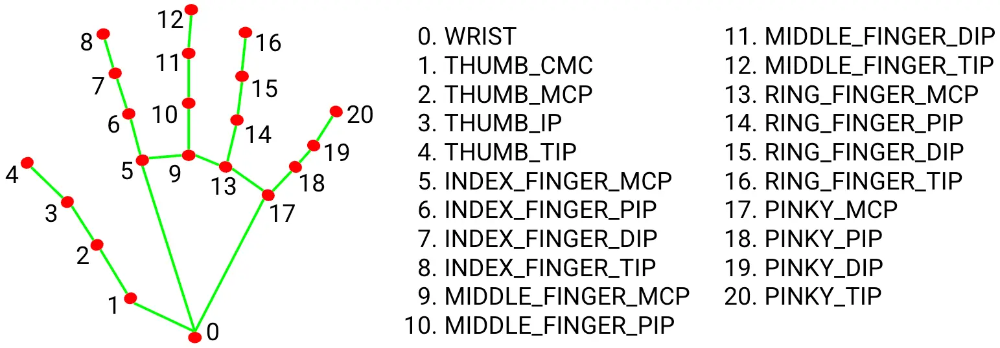

# OpenCV

### 环境配置

##### mac

```
pip install opencv-python 
pip install opencv-contrib-python
```

##### windows

```
pip install opencv-python==4.2.0.34 -i http://pypi.tuna.tsinghua.edu.cn/simple --trusted-host pypi.tuna.tsinghua.edu.cn
pip install opencv-contrib-python==4.2.0.34 -i http://pypi.tuna.tsinghua.edu.cn/simple --trusted-host pypi.tuna.tsinghua.edu.cn
```

<br>

### 回收资源

```python
# 只要使用了opencv必须回收资源
cv.destroyAllWindows()
```

<br>

### 导入和导出图片

```python
# 导入图片
img = cv.imread('./data/img/face.jpg')

# 弹窗显示图片
# 参数一：图片名称
# 参数二：图片的numpy对象
cv.imshow('img', img)
# 只有规定了等待时间才能看到图片，否则一闪而过
cv.waitKey(0)

# 导出图片
# 参数一：图片路径
# 参数二：图片的numpy对象
cv.imwrite('img_new.jpg', img)
```

<br>

### 灰度图

灰度图不影响识别人脸但是可以减少计算量，这个`cv.cvtColor()`方法提供了多种图片格式的转换

```python
gray = cv.cvtColor(img, cv.COLOR_BGR2GRAY)
```

<br>

### 改变大小

```python
resize_img = cv.resize(img, dsize=(400, 300))
```

<br>

### 绘制图形

##### 矩形

参数1：img。在哪个目标上绘制矩形

参数2：pt1。矩形左上角的点。长度为2的元组

参数3：pt2。矩形右下角的点。长度为2的元组

参数4：color。矩形的颜色。长度为3的元组（BGR）

参数5：thickness。矩形线条的厚度。默认为2

```python
cv.rectangle(img, (x1, y1), (x2, y2), (0, 0, 255), thickness=2)
```

##### 圆形

参数1：img。在哪个目标上绘制圆形

参数2：center。圆心的点。长度为2的元组

参数3：radius。圆的半径。一个值

参数4：color。矩形的颜色。长度为3的元组（BGR）

参数5：thickness。矩形线条的厚度。默认为2

```python
cv.circle(img, (x, y), 50, (0, 255, 255), thickness=2)
```

<br>

## faceCapture

### 预处理

- 调整为灰度

### 特征数据

- 加载特征数据

### 人脸检测

- 使用特征数据进行人脸检测
  - 参数1 image 待检测的图片
  - 参数2 scaleFactor 缩放因子
  - 参数3 minNeighbors 最小近邻
  - 参数4 minSize 人脸方框边长最小值（长度为2的元组）
  - 参数5 maxSize 人脸方框边长最大值（长度为2的元组）

### 绘制图形

- 矩形
- 圆形

```python
def face_detect_rec(img):
    # 灰度
    gray = cv.cvtColor(img, cv.COLOR_BGR2GRAY)
    # 加载特征数据
    face_detector = cv.CascadeClassifier('./data/haarcascade_frontalface_default.xml')
    # 进行人脸检测
    faces = face_detector.detectMultiScale(gray,
                                           scaleFactor=1.01,
                                           minNeighbors=3,
                                           minSize=(29, 29),
                                           maxSize=(35, 35))
    # 遍历每个人脸
    for face in faces:
        x, y, w, h = face
        
        # 绘制矩形
        pt1 = (x, y)
        pt2 = (x+w, y+h)
        color = (0, 0, 255)
        cv.rectangle(img, pt1, pt2, color, thickness=2)
        # 绘制圆形
        center = (x + w // 2, y + h // 2)
        radius = max(w, h)
        color = (0, 255, 255)  # 黄色=绿色+红色
        cv.circle(img, center, radius, color, thickness=2)
```

<br>

### faceCapture for vedio

```python
# 读取视频
    cap = cv.VideoCapture('./data/video/qiaolan.mp4')
    while True:
        # 读取一帧
        # 返回值1。flag：如果视频一直在播放，返回True。表示还有下一帧（如果是打开摄像头，则该值永远为True）
        # 返回值2。frame：对于的图片帧

        flag, frame = cap.read()
        if not flag:
            break

        face_detect_demo(frame)
        cv.imshow('img', frame)

        ret = cv.waitKey(10) # 0.01秒
        if ord('q') == ret:
            break

    cv.destroyAllWindows()
    # 释放视频的内存空间
    cap.release()
```

<br>

### faceDetect

#### 训练

- 准备特征数据、对应的标签
- 准备检测的工具
- 导入图片
- 将图片对应的标签放进标签列表
- 对数据进行预处理
- 人脸识别
- 将识别出来的人脸矩阵放进特征数据列表
- 生成人脸识别器实例模型
- 训练模型
- 导出模型

```python
import cv2 as cv
import os
import numpy as np


'''
训练模型需要的两个参数，特征+标签
参数1:numpy列表，人脸的特征数据
参数2:整形列表，每个特征的标签
'''
def readIMage(path):
    # 特征、标签
    faceSamples, ids = [], []
    # 图片路径列表
    imagePaths = []
    for f in os.listdir(path):
        fullpath = path + f
        imagePaths.append(fullpath)

    # 检测人脸的工具
    face_detector = cv.CascadeClassifier('./data/haarcascade_frontalface_default.xml')

    for imagePath in imagePaths:
        id = os.path.split(imagePath)[-1].split('.')[0].split('_')[0]
        # 导入数据
        img = cv.imread(imagePath)
        # 预处理
        # resized_img = cv.resize(img, (92, 112))
        gray_img = cv.cvtColor(img, cv.COLOR_BGR2GRAY)
        # 人脸识别
        faces = face_detector.detectMultiScale(gray_img)
        for face in faces:
            x, y, w, h = face
            faceImg = gray_img[y:y+h, x:x+w]
            faceSamples.append(faceImg)
            ids.append(int(id))

    return faceSamples, ids


if __name__ == '__main__':
    path = './data/train/'
    faceSamples, ids = readIMage(path)
    # 生成人脸识别器实例模型
    recognizer = cv.face.LBPHFaceRecognizer_create()
    # 训练模型
    recognizer.train(faceSamples, np.array(ids))
    # 导出模型
    recognizer.write('./data/trainer.yml')
```

<br>

#### 预测

- 导入模型
- 导入待预测的图片
- 检测人脸
- 使用模型识别检测出来的人脸判断置信度

```python
import cv2 as cv


# 获取训练数据文件
recognizer = cv.face.LBPHFaceRecognizer_create()
recognizer.read('./data/trainer.yml')
# 要预测的文件
predict_file = './data/test/8.JPG'
img = cv.imread(predict_file)
# 灰度
gray = cv.cvtColor(img, cv.COLOR_BGR2GRAY)
# 检测人脸的工具
face_detector = cv.CascadeClassifier('./data/haarcascade_frontalface_default.xml')
# 进行人脸检测
faces = face_detector.detectMultiScale(gray)
for face in faces:
    x, y, w, h = face
    faceImg = gray[y:y+h, x:x+w]
    # 预测
    id, confident = recognizer.predict(faceImg)
    print('这是第%d个人，置信度为%f' % (id, confident))
```

<br>

### Camera

使用摄像头进行拍照

```python
# 打开摄像头
def camera():
    nums = 0
    # 参数为0时表示打开内置摄像头
    cap = cv.VideoCapture(0)

    while True:
        # 因为打开的是摄像头所以第一个参数永远为True
        _, img = cap.read()
        # 因为摄像头是镜像所以需要反转画面
        img = cv.flip(img, 1)
        cv.imshow('Image', img)
        key = cv.waitKey(1)
        # 键盘输入q时退出
        if key == ord('q'):
            break
        # 键盘输入s时保存图片
        elif key == ord('s'):
            nums += 1
            cv.imwrite('./data/myHand_%d.jpg' % nums, img)

    cap.release()
    cv.destroyAllWindows()
```

<br>

## handDetect

### 配置环境

##### mac

```
pip install mediapipe
pip install protobuf
```

##### windows

```
pip install protobuf==3.19.6 -i http://pypi.tuna.tsinghua.edu.cn/simple --trusted-host pypi.tuna.tsinghua.edu.cn
pip install mediapipe -i http://pypi.tuna.tsinghua.edu.cn/simple --trusted-host pypi.tuna.tsinghua.edu.cn
```

### Detector

绘制手势+手势数据获取

注意我们的每个手指有21个关节，我们使用这个类获取每个关节的位置，根据这个位置判断手势



创建一个类使用`mediapipe`提供的接口

```python
import cv2 as cv
import mediapipe as mp


class HandDetector:
    # 初始化
    def __init__(self, mode=False, max_hands=2, complexity=1, detection_con=0.5, track_con=0.5):
        '''
        手势识别类初始化

        注意版本差异：
        低版本中参数为四个，分别是：
        :param mode: 是否为静态图片，默认False
        :param max_hands: 最多识别多少个手
        :param detection_confidence: 最小检测信度值，默认0.5
        :param track_confidence: 最小追踪信度值，默认0.5

        高版本中参数为五个，多了一个模型复杂度：
        static_image_mode
        max_num_hands
        model_complexity=新增！只有两个值0或1可选
        min_detection_confidence
        min_tracking_confidence
        '''
        self.mode = mode
        self.max_hands = max_hands
        self.complexity = complexity
        self.detection_con = detection_con
        self.track_con = track_con
        self.hands = mp.solutions.hands.Hands(mode, max_hands, complexity, detection_con, track_con)

    def find_hands(self, img):
        '''
        绘制手势
        :param img: 图片
        :return: 绘画了手势的图片
        '''
        # 传入的是bgr，改成rgb
        imgRGB = cv.cvtColor(img, cv.COLOR_BGR2RGB)
        # 检测手势
        self.results = self.hands.process(imgRGB)
        # 判断是否有手
        if self.results.multi_hand_landmarks:
            # 遍历每只手
            for handlms in self.results.multi_hand_landmarks:
                '''
                绘制手势
                参数1：image
                参数2：landmark_list 手势列表
                参数3：connections 连线（可忽略）
                参数4：关节样式（可忽略）
                参数5：连线样式（可忽略）
                '''
                mp.solutions.drawing_utils.\
                    draw_landmarks(img, handlms,
                                   mp.solutions.hands.HAND_CONNECTIONS,
                                   mp.solutions.drawing_styles.get_default_hand_landmarks_style(),
                                   mp.solutions.drawing_styles.get_default_hand_connections_style())

        return img

    def find_positions(self, img):
        '''
        :param img: 图片
        :param hand_no: 手编号（默认第0只手）
        :return: 手势数据列表
        '''
        self.handslst = []
        if self.results.multi_hand_landmarks:
            '''
            注意hand.landmark的返回值
            因为最多允许检测两只手，因此返回的是一个三维数组
                第一个纬度：手
                第二维度：关节
                第三维度：
                    x：相对于屏幕左上角的水平距离
                    y：相对于屏幕左上角的竖直距离
                    z：相对于掌根的距离
            '''
            # landmarks得到的是关节点在图片中的比例位置，乘上图片的实际尺寸才是真实坐标
            hands = self.results.multi_hand_landmarks
            # 循环每只手
            for hand in hands:
                lmslist = []
                # 循环每个关节
                for idx, lm in enumerate(hand.landmark):
                    h, w, _ = img.shape
                    # 获取具体坐标
                    cx, cy = int(lm.x * w), int(lm.y * h)
                    lmslist.append([idx, cx, cy])
                self.handslst.append(lmslist)

        return self.handslst
```

<br>

### Number

根据手势数据判断手势

```python
import cv2 as cv
import numpy as np
from handDetector import HandDetector


def main():
    # 保存图片的个数
    save_nums = 0
    # 打开摄像头，参数为0时表示打开内置摄像头
    cap = cv.VideoCapture(0)
    # 创建手势识别对象
    detector = HandDetector()
    # 手指头列表
    tip_idx = [4, 8, 12, 16, 20]
    # 手势图片路径
    fingersImgPath = [f'./data/fingers/{i}.png' for i in range(6)]
    # 手势图片导入
    fingersImgLst = [cv.imread(i) for i in fingersImgPath]

    while True:
        # 因为打开的是摄像头所以第一个参数永远为True
        _, img = cap.read()

        # 因为摄像头是镜像所以需要反转画面
        img = cv.flip(img, 1)

        # 绘制手势
        img = detector.find_hands(img)

        # 获取手势数据
        handslst = detector.find_positions(img)
        for i, hand in enumerate(handslst):
            # 在指尖描绘圆点
            fingers = []
            '''
            ！！！特别注意！！！
            掌心面向屏幕，掌背面向自己区分左右手
            左右手的判断根据: 食指掌根5 和 中指掌根9 位置进行判断

            大拇指要特殊处理
            首先是根据左右手区别处理
            根据 大拇指指尖4 和 大拇指指尖下的关节3 的水平位置进行判断
            再根据 大拇指指尖4 和 食指指根5 的竖直距离进行判断
            综合上述两个条件才满足大拇指闭合！
            '''
            # 判断左右手，1为左手0为右手
            direction = True if hand[5][1] > hand[9][1] else False
            for tip in tip_idx:
                # 获取每个指尖的位置并画圆
                x, y = hand[tip][1], hand[tip][2]
                cv.circle(img, (x, y), 20, (0, 255, 0), 2)

                # 判断每个指头是否打开
                # 特判大拇指，需要区分左右手
                if tip == 4:
                    if direction:
                        fingers.append(0 if hand[tip][1] < hand[tip + 1][1] else 1)
                    else:
                        fingers.append(0 if hand[tip][1] > hand[tip + 1][1] else 1)
                    continue
                # 其他手指
                fingers.append(1 if hand[tip][2] < hand[tip - 2][2] else 0)

            # 获取手势显示图片
            fingerImg = fingersImgLst[fingers.count(1)]
            # 获得图片的高宽
            h, w, _ = fingerImg.shape
            # 根据左右手判断图片出现位置，左手左上角右手右上角
            if direction:
                img[0:h, 0:w] = fingerImg
            else:
                screen_h, screen_w, _ = img.shape
                img[0:h, screen_w - w:] = fingerImg

        cv.imshow('Image', img)
        key = cv.waitKey(1)
        # 键盘输入q时退出
        if key == ord('q'):
            break
        # 键盘输入s时保存
        elif key == ord('s'):
            save_nums += 1
            cv.imwrite('./data/myHand_%d.jpg' % save_nums, img)

    cap.release()
    cv.destroyAllWindows()


if __name__ == '__main__':
    main()
```

<br>

## 图像识别

### 环境配置

mac

```
pip install tensorflow
pip install scikit-learn
```

windows

```
pip install tensorflow==1.13.2 -i http://pypi.tuna.tsinghua.edu.cn/simple --trusted-host pypi.tuna.tsinghua.edu.cn
pip install scikit-learn -i http://pypi.tuna.tsinghua.edu.cn/simple --trusted-host pypi.tuna.tsinghua.edu.cn
```

<br>

### dataProcess

需要准备的数据：

- 训练集 + 训练集对应标签
- 验证集 + 验证集对应标签
- 图片名称
- 类别

我们写一个数据处理类，用来将数据进行**预处理**和**划分**

数据预处理包括了**统一尺寸**和**数据归一化**

划分包括**数据洗牌**和按照我们规定的划分比例将**数据划分**数据集为训练集和验证集

注意最后我们的数据是要给tensorflow训练的，所以要转成numpy

```python
import cv2 as cv
import os
import glob
import numpy as np
from sklearn.utils import shuffle
from dataset import *


# 数据处理相关的类
class DataProcess:
    def __init__(self):
        pass

    # 获取数据
    def load_data(self, train_path, classes, img_size):
        '''
        读取训练数据
        参数1：train_path 训练集+验证集数据的路径
        参数2：classes 分类值
        参数3：image_size 图片统一的尺寸大小
        :return1：image，预处理过后的图片
        :return2：labels，独热编码描述的标签
        :return3：image name，对应的文件名
        :return4：cls，类别
        '''
        images, labels, img_names, cls = [], [], [], []

        # 遍历每个类别
        for index, fields in enumerate(classes):
            # 将*g添加到路径结尾 ./data/training_data/dogs/*g
            path = os.path.join(train_path, fields, '*g')
            # 搜素指定目录下所有以g结尾的文件
            files = glob.glob(path)
            # 遍历具体每一个图片的路径
            for file in files:
                img = cv.imread(file)
                '''
                统一图片尺寸
                参数1：src路径
                参数2：dsize输出图片的尺寸
                参数3：fx沿水平方向的比例因子
                参数4：fy沿竖直方向的比例因子
                参数5：interpolation插值方法
                        INTER_NEAREST 最近邻 
                        INTER_LINEAR 双线性
                '''
                img = cv.resize(img, img_size, 0, 0, cv.INTER_LINEAR)
                '''
                数据归一化
                标准化：缩放到均值为0，方差1
                归一化：缩放到最大值为1，最小值为0
                
                图像中每帧的数据是0-255，因此使用归一化
                只需要对于每个数都除以255即可
                
                使用np中的归一化方法multiply
                需要先将img的类型转化为浮点数
                '''
                img = np.multiply(img.astype(np.float32), 1.0 / 255.0)
                images.append(img)

                # 使用独热编码生成类别标签
                label = np.zeros(len(classes))
                label[index] = 1.0
                labels.append(label)

                # 添加文件名
                fileBase = os.path.basename(file)
                img_names.append(fileBase)

                # 添加分类
                cls.append(fields)

        # 转换类型
        images, labels, img_names, cls = np.array(images), np.array(labels), np.array(img_names), np.array(cls)
        return images, labels, img_names, cls

    # 数据预处理以及划分训练集
    def read_train_sets(self, train_path, classes, img_size):
        # 数据预处理
        images, labels, img_names, cls = self.load_data(train_path, classes, img_size)

        # 洗牌，将顺序打乱不要一堆狗一堆猫，利于学习
        images, labels, img_names, cls = shuffle(images, labels, img_names, cls)

        # 划分验证集
        validation_size = int(images.shape[0] * 0.2)
        # 前百分之二十作为验证集
        images_vali = images[:validation_size]
        labels_vali = labels[:validation_size]
        img_names_vali = img_names[:validation_size]
        cls_vali = cls[:validation_size]
        # 后百分之八十作为训练集
        images_train = images[validation_size:]
        labels_train = labels[validation_size:]
        img_names_train = img_names[validation_size:]
        cls_train = cls[validation_size:]

        # 创建两个DataSet对象
        data_sets = DataSets()
        data_sets.vali = DataSet(images_vali, labels_vali, img_names_vali, cls_vali)
        data_sets.train = DataSet(images_train, labels_train, img_names_train, cls_train)

        return data_sets

```

<br>

### dataSet

该类负责存储数据，支持从中提取数据

```python
class DataSet:
    # 构造类
    def __init__(self, images, labels, img_names, cls):
        self.__num_examples = images.shape[0]
        self.__images = images
        self.__labels = labels
        self.__img_names = img_names
        self.__cls = cls

    def get_images(self):
        return self.__images

    def get_labels(self):
        return self.__labels

    def get_img_names(self):
        return self.__img_names

    def get_cls(self):
        return self.__cls

    def get_num_examples(self):
        return self.__num_examples


class DataSets:
    pass
```

<br>

### train

```python
from dataprocess import *
from dataset import *


def run():
    # 指定读取数据的位置（目录）
    train_path = './data/training_data/'
    # 指定类别
    classes = ['dogs', 'cats']
    # 图片大小
    img_size = (64, 64)

    # 数据处理
    dp = DataProcess()
    data = dp.read_train_sets(train_path, classes, img_size)


if __name__ == '__main__':
    run()

```

<br>

### Mac for TensorFlow

tensorflow官方是并不支持mac的，因此如果要使用mac来进行深度学习操作的种种，需要很多额外的操作。

- conda 
- tensorflow-metal [苹果开发者提供的 tensorflow](https://developer.apple.com/metal/tensorflow-plugin/)

#### Conda

管理python版本的强大利器

```shell
# 创建一个虚拟环境，命名为name，指定使用python3.6版本
conda create -n name python=3.6

# 查看所有虚拟环境
conda info --envs

# 使用目标环境
activate name

# 退出当前虚拟环境，注意只有先退出了当前环境才可以切换成别的环境
conda deactivate

# 删除名称为name的虚拟环境
conda remove -n name --all

# 刷新
conda clean --all 
```

#### Tensorflow-mac

在装好了conda的条件下

```sh
# 准备苹果的tensorflow环境
conda install -c apple tensorflow-deps

# 下载tensorflow
python -m pip install tensorflow-macos

# 下载插件
python -m pip install tensorflow-metal
```

[tensorflow 官网教程](https://www.tensorflow.org/learn)

<br>

## Error

- 报错信息：error: (-215:Assertion failed) !_src.empty() in function 'cvtColor'

解决方法：路径含中文、路径出错、mac专有：受`.DS_store`影响

- 报错信息：TypeError:create_int（）

解决方法：函数参数不兼容，可能是参数输入错了也有可能是版本问题
