# 函数图像

| 幂函数 | 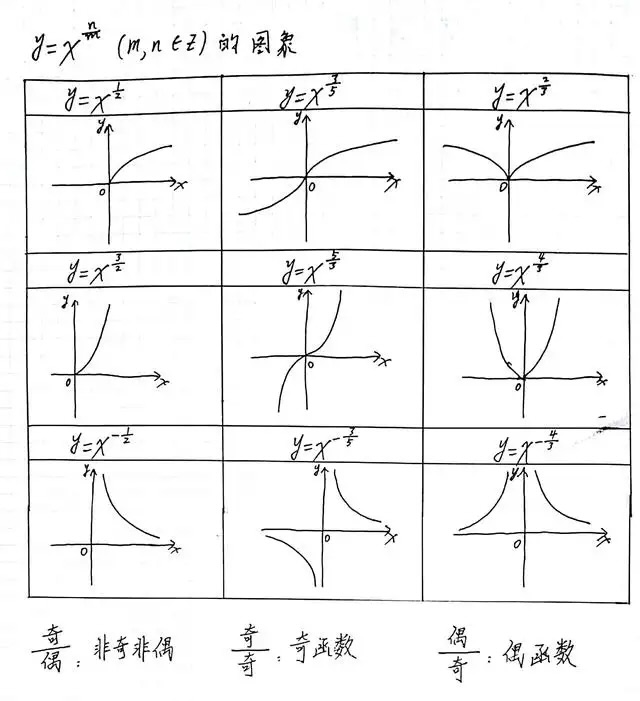 |
| ------ | ------------------------------------------------------------ |

| 指数函数                                                     | 对数函数                                                     |
| ------------------------------------------------------------ | ------------------------------------------------------------ |
| 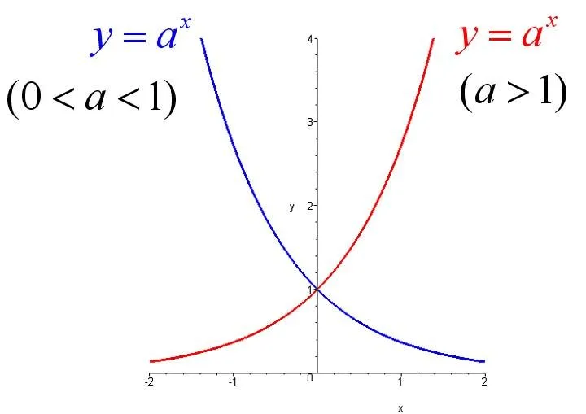 | 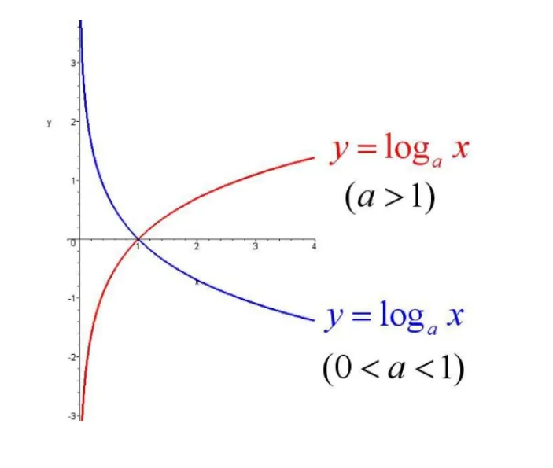 |

| $y=\sin x$                                                   | $y=\cos x$                                                   |
| ------------------------------------------------------------ | ------------------------------------------------------------ |
| 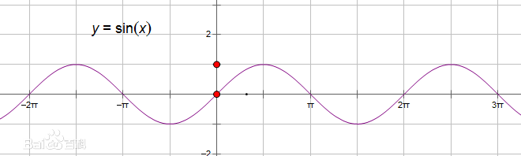   | 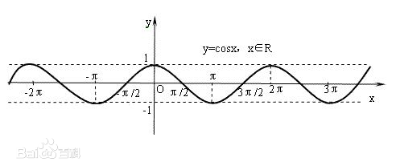   |
| $y=\tan x$                                                   | $y=\cot x$                                                   |
| 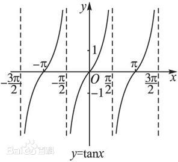   | 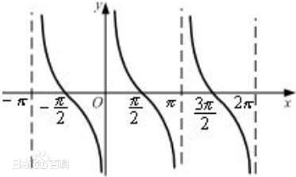   |
| $y=\arcsin x$                                                | $y=\arccos x$                                                |
| 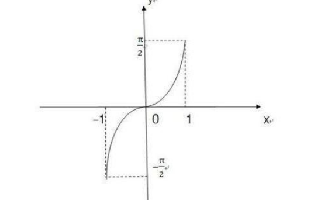 | 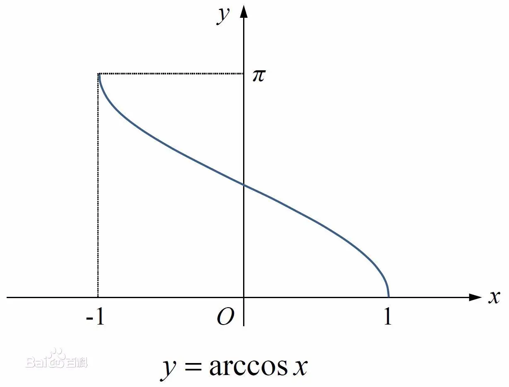 |
| $y=\arctan x$                                                | $y=arc\cot x$                                                |
| 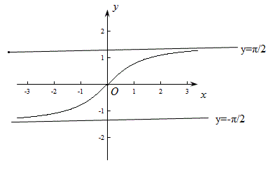 | 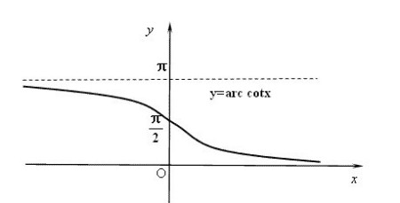 |
| 反函数                                                       | $y = f(x)$ 与 $x = f^{-1}(y)$ 图像相同； $y = f(x)$ 与 $y = f^{-1}(x)$ 图像关于 $y = x$ 对称 |

