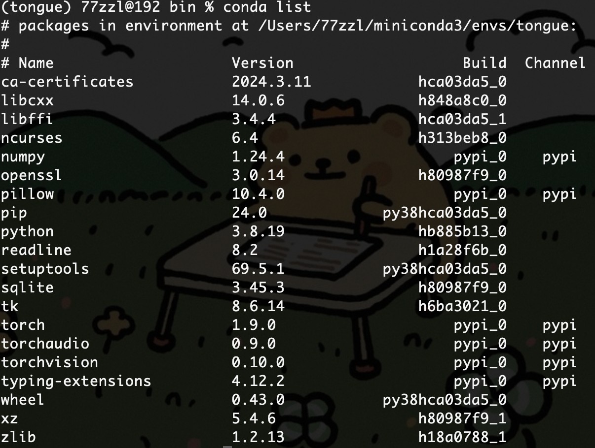

# Conda

### 常见指令

- **查看版本**：`conda --version`

- **环境管理**：
  - **创建环境**：`conda create -n env_name package_name` 用于创建一个新的conda环境，并在其中安装指定的包。例如，`conda create -n python3 python=3.7 numpy pandas` 创建一个名为python3的环境，Python版本为3.7，并安装numpy和pandas包。
  - **激活和退出环境**：使用 `conda activate env_name` 和 `conda deactivate` 来切换到或退出某个环境。
  - **列出环境**：`conda info --envs` 或 `conda env list` 可以查看所有已创建的环境。
  - **复制和删除环境**：`conda create --name new_env_name --clone old_env_name` 用于复制一个现有环境，而 `conda remove --name env_name --all` 用于删除一个环境。
    - 不自动进入任何环境（现在打开终端自动进入base环境）可以设置如下操作：`conda config --set auto_activate_base false`
- **包管理**：
  - **安装包**：`conda install package_name` 在当前环境中安装包。也可以指定在特定环境中安装，如 `conda install -n env_name package_name`。
  - **更新包**：`conda update package_name` 更新指定的包到最新版本。使用 `conda update --all` 可以更新所有包。
  - **删除包**：`conda remove package_name` 删除当前环境中的包。指定环境中删除包可以使用 `conda remove -n env_name package_name`。
  - **列出已安装的包**：`conda list` 可以查看当前环境中所有已安装的包。使用 `conda list -n env_name` 可以查看特定环境中的包。

 

### 实例

> 为搭建[基于深度学习的舌象诊断系统](https://github.com/NinjaRabbitOvO/Tongue_diagnosis_Sysytem)需要用到3.8版本的python以及1.9.0版本的torch。截止本文编写python已然更新到3.12，为了不与其他项目冲突故使用conda搭建一个适配的环境。

在最初的尝试中我直接使用Miniconda来安装3.8版本的python，但发现conda的库中并不包含该版本，于是改用了Miniforge，Miniforge是Miniconda的一个版本，专门为ARM架构设计。它可能包含更多的ARM架构的包。

1. 退出当前环境`conda deactivate`
2. 因为我的环境变量下path默认地址是Miniconda的，所以这里手动进入Miniforge的目录下`cd ~/miniforge3/bin`
3. 创建环境并安装python==3.8`conda create -n tongue python=3.8`
4. 进入新的环境`conda activate tongue`
5. 安装符合要求的pytorch，需要通过[官网](https://pytorch.org/get-started/previous-versions/#osx-55)查询版本`pip install torch==1.9.0 torchvision==0.10.0 torchaudio==0.9.0`
6. 检查当前的包`conda list`

