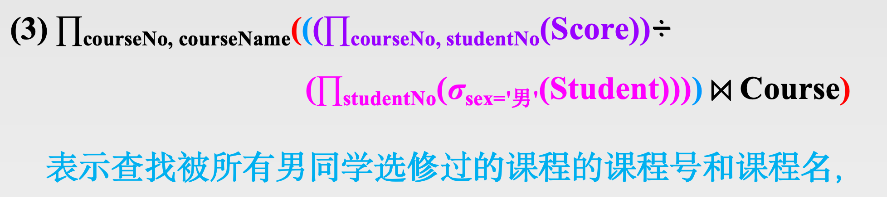
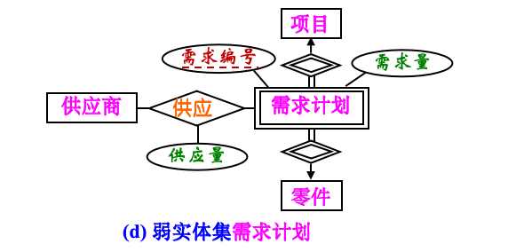
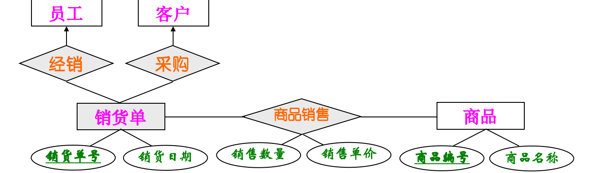

# 数据库

> 数据库需要解决的就是**文件系统存在的弊端**

> - 数据共享性差（数据冗余和不一致）
> - 数据独立性差（数据与应用程序之间缺乏逻辑独立性）
> - 数据孤立、数据获取困难（数据与数据之间的关系）
> - 完整性差（一致性**约束**）
> - 原子性问题（保证原子性操作）
> - 并发访问异常
> - 安全性问题（访问问题）

<br>

## 基本概念

### 数据库系统DBS

是指在计算机系统中引入数据库后的系统，一般由数据库、数据库管理系统(及其应用开发工具)、应用系统、数据库管理员和最终用户构成

<br>

### 数据库管理系统DBMS

#### 定义

- 存储结构与索引、查询与优化、完整性与安全、事务与恢复等

- 是由一个相互关联的**数据的集合**和一组用以访问、管理和控制这些数据的**程序**组成，该数据集合通常称为**数据库(database, DB)**
- 是位于用户与操作系统之间的一层数据管理软件，它提供一个可以方便且高效地存取、管理和控制数据库信息的**环境**
- 和操作系统一样，都是计算机的基础软件（系统软件），也是一个大型复杂的软件系统

#### 主要特点

- **数据结构化**。数据库管理系统实现**数据的整体结构化**，这是数据库的主要特征之一，也是数据库管理系统与文件系统的**本质区别**
- **数据的共享度高，冗余度底，易扩充**
- **数据独立性高**
  - **数据独立**是指数据的使用（即应用程序）与数据的说明（即数据的组织结构与存储方式）分离
  - **数据独立性**用来描述应用程序与数据结构之间的依赖程度，包括数据的物理独立性和数据的逻辑独立性
  - **物理独立性**是指用户的**应用程序**与数据库中数据的**物理结构**是相互独立的
  - **逻辑独立性**是指用户的**应用程序**与数据库中数据的**逻辑结构**是相互独立的
- **数据由数据库管理系统（DBMS）统一管理和控制**
  - 数据的安全性保护
  - 数据的完整性检查
  - 并发控制
  - 数据恢复

#### 组成

- **查询处理器**：对用户请求的SQL操作进行查询优化，从而找到一个最优的执行策略，然后向存储管理器发出命令，使其执行。
- **存储管理器**：根据执行策略，从数据库中获取相应的数据,或更新数据库中相应的数据。
- **事务管理器**：负责保证系统的完整性，保证多个同时运行的事务不发生冲突操作，以及保证当系统发生故障时数据不会丢失。 

<br>

## 数据模型

> 数据库结构的基础是数据模型

### 定义

数据模型是一个描述数据结构、数据操作以及数据约束的数学形式体系(即概念及其符号表示系统)

- 数据结构用于刻画数据、数据语义以及数据与数据之间的联系
- 数据约束是对数据结构和数据操作的一致性、完整性约束，亦称为数据完整性约束 

通过数据模型可以对现实世界的数据特征进行抽象，根据数据抽象的不同级别，将数据模型划分为3类

- 概念模型：概念层次的数据模型，也称为信息模型
- 逻辑模型：用于描述数据库数据的整体逻辑结构 
- 物理模型：用来描述数据的物理存储结构和存取方法

<br>

### 数据库三层数据模型

> 数据库三层数据模型是数据库设计的工具和方法，提供概念模型、逻辑模型和物理模型，通过逐层设计一应用系统的数据库，实现：从现实世界到信息世界、信息世界到逻辑机器世界、逻辑机器世界到物理机器世界的逐步转换(对应模式与内模式要求)

#### 概念模型

> 按用户的观点或认识对现实世界的数据和信息进行建模

常见的概念模型有**实体-联系模型**(E-R模型)和**面向对象模型**(OO模型) 

- **E-R**：现实世界是由一组称作实体的基本对象以及这些对象间的联系构成

- **OO**：用面向对象观点来描述现实世界实体(对象)的逻辑组织、对象间限制和联系等的模型
  - **对象**是由一组数据结构和在这组数据结构上操作的程序代码封装起来的基本单位

#### 逻辑模型

是用户通过数据库管理系统看到的现实世界，是按计算机系统的观点对数据建模，即数据的计算机实现形式

#### 物理模型

- 物理层是数据抽象的最低层
- 物理模型的具体实现是DBMS的任务，数据库设计人员要了解和选择物理模型，一般用户则不必考虑物理层细节

<br>

### 组成要素

- **数据结构**：描述数据库的组成对象以及对象之间的联系 
- **数据操作**：指对数据库中各种对象(型)的实例(值)允许执行的操作集合，包括操作及有关的操作规则
- **数据完整性约束**：一组数据完整性规则，是数据、数据语义和数据联系所具有的制约和依存规则，包括数据**结构完整性规则**和**数据操作完整性规则**，用以限定符合数据模型的数据库状态以及状态的变化，以保证数据库中数据的正确、有效和相容

<br>

### 层次模型

> 层次模型用**树形结构**来表示各类实体以及实体间的联系。

#### 表示方法

- 实体用记录来表示，实体间的联系用**链接(可看作指针)**来表示
- 每个结点表示一个记录型，记录(型)之间的联系用结点之间的连线(有向边)表示，这种联系是父子之间的一对多的联系
- 每个记录型由若干个字段组成，记录型描述的是实体，字段描述的是实体的属性
- 每个记录型可以定义一个排序字段，也称为码字段，如果所定义的排序字段的值唯一，则它也可以用来唯一标识一个记录值

#### 主要优点

- 数据结构比较简单清晰
- 查询效率高
- 提供了良好的数据完整性支持

<br>

### 网状模型

> 满足如下两个条件的基本层次联系的集合称为网状模型
>
> - 允许一个以上的结点无双亲
> - 一个结点可以有多个双亲

#### 主要优点

- 能够更为直接地描述现实世界
- 具有良好的性能，存取效率较高

<br>

### 关系模型

> 关系模型的数据操作是集合操作，操作对象和操作结果都是关系(元组的集合)——不同于传统的非关系模型的数据操作：单记录操作

#### 常用术语

- 关系(relation)：一个关系对应一张二维表，每一个关系有一个名称，即关系名；
- 元组(tuple)：表中的一行称为一个元组；
- 属性(attribute)：表中的一列称为一个属性，每一个属性有一个名称，即属性名；
- 码(key)：也称为码键或键。表中的某个属性或属性组，它可以唯一地确定关系中的一个元组，如关系Student中的学号，它可以唯一地标识一个学生 ；
- 域(domain)：属性的取值范围；
- 分量(component)：元组中的一个属性值；
- 外码(foreign key)：表中的某个属性或属性组，用来描述本关系中的元组(实体)与另一关系中的元组(实体)之间的联系；
- 关系模式(relational schema)：通过关系名和属性名列表对关系进行描述，即二维表的表头部分(表格的描述部分)；

#### 规范化

> 关系模型要求关系必须是规范化的，即要求关系必须满足一定的规范条件。

- 关系的每一个元组必须是可分区的，即**存在码属性** 
- 关系的每一个属性(即元组的分量)必须是一个不可分的数据项，即**不允许表中有表**

关系数据模型的完整性约束

- 实体完整性
- 参照完整性
- 用户自定义完整性

#### 主要优点

- 严格的数学基础：有关系代数作为语言模型，有关系数据理论作为理论基础
- 概念单一：无论实体还是实体之间的联系都是用关系来表示，对数据(关系)的操作(查询和更新)结果还是关系。所以其数据结构简单、清晰，用户易懂易用
- 存取路径透明：具有更高的数据独立性、更好的安全保密性，简化了程序员的工作，提高了软件的开发和维护效率

<br>

## 数据抽象

- **DBMS**：隐藏关于数据存储和维护的某些细节，为用户提供数据在不同层次上的视图
- **物理层抽象**：最低层次的抽象，描述数据实际上是怎样存储的
- **逻辑层抽象**
  - 描述数据库中存储什么数据以及这些数据之间存在什么关联
  - 提供给数据库管理员和数据库应用开发人员使用的，必须明确知道数据库中应该保存哪些信息
- **视图层抽象**
  - 最高层次的抽象，只描述整个数据库的某个部分，即局部逻辑结构
  - 系统可以为同一数据库提供多个视图，每一个视图对应一个具体的应用，亦称为应用视图

<br>

## 数据库的三级模式

> 数据库三级模式结构是数据库管理系统(DBMS)的体系结构，提供外模式、模式和内模式，通过从不同抽象级别观察数据库中的数据，实现：对用户屏蔽DBMS的复杂性、简化用户与系统的交互的目的

### 外模式

- 也称子模式或用户模式，**对应于视图层数据抽象**

- 是数据库用户(包括应用程序员和最终用户)能够看见和使用的局部数据的逻辑结构和特征的描述，是数据库用户的数据视图，是与某一具体应用有关的数据的逻辑表示
- 外模式是保证数据库安全性的一个有力措施，每个用户只能看见和访问所对应的外模式中的数据，数据库中的其余数据是不可见的 

### 模式

- 也称为逻辑模式，**对应于逻辑层数据抽象**，是数据库中全体数据的逻辑结构和特征的描述，是所有用户的公共数据视图
- 模式的一个具体值称为模式的一个实例(instance)
- 它是DBMS模式结构的中间层，既不涉及数据的物理存储细节和硬件环境，也与具体的应用程序、所使用的应用开发工具及高级程序设计语言无关
- **模式即全局逻辑结构是数据库的核心和关键，它独立于数据库的其他层次。因此，设计数据库模式结构时，应首先确定数据库的逻辑模式**

### 内模式

- 也称存储模式，**对应于物理层数据抽象**，它是数据的物理结构和存储方式的描述，是数据在数据库内部的表示方式

### 数据库的两层映像功能

#### 外模式/模式映像

- 对应于一个模式可以有多个外模式。对于每一个外模式，数据库管理系统都有一个模式/外模式映像，它定义了该外模式与模式之间的对应关系
- 在各自的外模式描述中定义外模式/模式映像
- 保证了数据与应用程序的逻辑独立性，简称为数据的逻辑独立性 

#### 模式/内模式映像 

- 数据库中只有一个模式，也只有一个内模式，模式/内模式映像是唯一的，它定义了数据全局逻辑结构与存储结构之间的对应关系
- 在模式描述中定义模式/内模式映像
- 保证了数据与应用程序的物理独立性，简称为数据的物理独立性

<br>

### 数据库三级模式与三层模型的联系与区别

> 数据库的三级模式与三层模型之间的区别在于：**作用和目的不一样**

三级模式是DBMS的体系结构，目的是

- 隐藏数据的存储和维护的细节，为用户提供数据在不同层次上的视图，方便不同的使用者可以从不同的角度去观察和利用数据库中的数据。   
- 支持数据独立性的实现。   
- 提供全局逻辑视图(模式)：支持整体结构化，从而实现数据共享度高、冗余度低、易扩充。   
- 部分支持安全性的实现。

三层模型是数据库设计的工具和方法(要满足DBMS体系结构的要求)，目的是

- 较真实地模拟现实世界、容易被人理解、便于计算机实现。一个数据模型不可能同时满足这些要求！   
- 提供全局逻辑模型：支持整体结构化，从而实现数据共享度高、冗余度低。   
- 同时满足DBMS三级模式结构(模式与内模式)要求。

<br>

## 关系模型

> 关系模型由关系数据结构、关系操作集合和关系完整性约束三部分组成

### 关系

- 关系模型的数据结构非常简单，它就是二维表，亦称为关系 。 
- 关系数据库是表的集合，即关系的集合。 
- 表是一个实体集，一行就是一个实体，它由共同表示一个实体的有关联的若干属性的值所构成。
- 由于一个表是这种有关联的值的集合(即行的集合)，而表这个概念和数学上的关系概念密切相关，因此称为关系模型。
- 关系模型中，现实世界的实体以及实体间的各种联系都是用关系来表示。

### 关系的形式化定义

- $D1×D2×…×Dn$的有限子集称为在域D1, D2, …, Dn上的关系，表示为 ：$r(D1, D2, …, Dn)$
- 其中，r表示关系的名字，n是关系的目或度(degree)。
- 当n=1时，该关系称为**单元关系**；当n=2时，称为**二元关系**。关系是笛卡尔积的有限子集，所以关系也是一个二维表,  表的每行对应于关系的一个元组，表的每列对应于关系的一个域。由于域可以相同，为了区别就必须给每列起一个名字，称为属性(attribute)。n目关系共有n个属性。
- 空值(null)是所有可能的域的一个取值，表明值未知或值不存在。

### 关系的最基本要求

- 关系中的每个属性的域必须是原子的，即域中的每个值都是不可再分的一个完整单元。 
- 关系中的每个元组都是可区分的，即存在唯一标识不同元组的属性(集)——码。

### 表头部分和表体部分

- 表头部分定义了该表的结构，即定义了该表由哪些列构成(假设由n列构成)，每个列的名字和取值范围等。
  - 表头部分对应于**关系模式**，它定义了元组集合的结构，即定义了一个元组由哪些属性构成(假设由n个属性构成)，每个属性的名字和来自的域等。 关系模式是型的概念。
- 表体部分就是所有数据行(元组)的集合，每一个数据行都是由表头部分规定的n列有关联的取值的集合构成。 
  - 表体部分对应于**关系**，每一个数据行对应于关系的一个元组，即关系是元组的集合。关系是值的概念。

### 码

- **超码**：对于关系r的一个或多个属性的集合A，如果属性集A可以唯一地标识关系r中的一个元组，则称属性集A为关系r的一个超码 (superkey) 。  
- **候选码**：对于关系r的一个或多个属性的集合A，如果属性集A是关系r的超码，**且属性集A的任意真子集都不能成为关系r的超码（最小超码）**，则称属性集A为候选码 (candidate key) 。
- **主码**：若一个关系有多个候选码，则可以选定其中的一个候选码作为该关系的主码 。
  - 主码的选择原则：
    - 选择属性长度最短的候选码；
    - 选择包含单个属性的码，而不是复合候选码；
    - 选择在数据库系统生命周期内属性值最少变化的候选码；
    - 选择在数据库系统生命周期内更可能包含唯一值的候选码。

- **外码**：设F是关系r的一个属性(或属性集)，Ks是关系s的主码。如果F与Ks相对应(即关系r中属性F的取值范围对应于关系s中主码Ks的取值范围的子集)，则称F是关系r参照关系s的外码(foreign key)，简称F是关系r的外码。
  - 称关系r为参照关系，关系s为被参照关系或目标关系。

### 关系完整性约束条件

> 任何关系数据库管理系统都应该支持实体完整性和参照完整性 。

- **实体完整性**
  - 主码不能取空

- **参照完整性**
  - 对于一个外码，要么取值为空，要么为其被参照关系的主码的取值
- **用户自定义完整性**
  - 用户定义完整性是针对某一具体应用要求来定义的约束条件，它反映某一具体应用所涉及的数据必须满足的语义要求。

### 模式导航图

> 一个含有主码和外码依赖的数据库模式可以通过模式导航图来表示。


### 关系操作

>  可用两种方式来表示——代数方式和逻辑方式。

- 关系代数是用代数方式表达的关系查询语言。
- 关系演算是用逻辑方式表达的关系查询语言。
  - 关系演算又可按谓词变元的基本对象是元组变量还是域变量分为元组关系演算和域关系演算。

<br>

## 关系代数

> - 关系代数是通过关系代数运算构成的表达式来表达查询。
> - 基本的关系代数运算有选择、投影、集合并、集合差、笛卡尔积和更名等。 
> - 关系代数运算是以一个或两个关系作为输入(即运算对象)产生一个新的关系作为结果。

### 传统的集合运算

> 前提假设：关系r和关系s具有相同的n个属性，且相应的属性取自同一个域，即两个关系的模式或结构相同。t是元组变量，t∈r表示t是r的一个元组。

#### 并运算 

关系r与关系s的并记作 ：


其结果关系仍为n目关系，由属于r或属于s的所有元组组成。

#### 差运算

关系r与关系s的差记作 ：


其结果关系仍为n目关系，由属于r而不属于s的所有元组组成。 

#### 交运算    

关系r与关系s的交记作：


其结果关系仍为n目关系，由既属于r又属于s的所有元组组成。关系的交可以通过差来表达，即r∩s = r-(r-s)。

#### 笛卡尔积 

> 属性相加，元组相乘

- 两个分别为n目和m目的关系r和s的笛卡尔积是一个n+m目元组的集合。      
- 元组的前n列是关系r的一个元组，后m列是关系s的一个元组若关系r有kr个元组，关系s有ks个元组，则关系r和s的笛卡尔积有kr×ks个元组。

记作 ：


### 专门的关系运算

#### 选择            

> 即根据业务需求设置的条件查看元组

选择操作是在关系r中查找满足给定谓词（即选择条件）的所有元组，记作：                        


P表示谓词(即选择条件)，它是一个逻辑表达式，取值为“真”或“假”。

#### 投影    

> 即仅查看个别属性       

关系是一个二维表，对它的操作可以从水平(行)的角度进行，即选择操作；也可以从纵向(列)的角度进行，即投影操作。            

关系r上的投影是从r中选择出若干属性列组成新的关系。记作：


#### 连接

> 即多表查询

连接也称为θ连接。θ连接运算就是从关系r和s的笛卡尔积r×s中，选取r关系在A属性集上的值与s关系在B属性集上的值**满足连接谓词θ**的所有元组。（按照一定条件多表查询）

连接运算中有两种最常用、最重要的连接，一种是等值连接(equijoin)，另一种是自然连接(natural join)。

- θ为等值比较谓词的连接运算称为等值连接。
- 自然连接是一种特殊的等值连接，它要求两个参与连接的关系具有公共的属性集，并在这个公共属性集上进行等值连接；同时，还要求将连接结果中的重复属性列去除掉，即在公共属性集中的列只保留一次。


#### 除运算

首先，除运算是作用于两个集合的运算。接着，被除数集合按照除数集合的要求进行筛选。

看几个例子：





<br>

## SQL

### SQL语言组成

#### 数据操纵语言DML(Data Definition Language)

定义数据库的逻辑结构，包括数据库、基本表、视图和索引等，扩展DDL还支持存储过程、函数、对象、触发器等的定义

- 查询：SELECT
- 插入：INSERT
- 修改：UPDATE
- 删除：DELETE

#### 数据定义语言DDL(Data Manipuplation Language)

对数据库的数据进行检索和更新

- 创建对象：CREATE
- 删除对象：DROP
- 修改对象：ALTER

#### 数据控制语言DCL(Data Manipuplation Language)

对数据库的对象进行授权、用户维护(包括创建、修改和删除)、完整性规则定义和事务定义等

- 权限授予：GRANT
- 权限收回：REVOKE

<br>

### 基本概念

- **基本表**

  - 数据库中独立存在的表称为基本表

  - 在SQL中一个关系对应一个基本表
  - 一个(或多个)基本表对应一个存储文件
  - 一个表可以带若干索引
  - 索引存放在存储文件中

- **视图**

  - 指从一个或几个基本表(或视图)导出的表，是虚表只存放视图的定义而不存放对应数据

- **查询表**

  - 指查询结果对应的表

- **存储文件**

  - 指数据库中存放关系的物理文件

<br>

### 单表查询

#### 投影运算

> SELECT和FROM是必须的，其他是可选的

**SQL基本结构包括3个子句：**

- SELECT子句对应投影运算，指定查询结果中所需要的属性或表达式
- FROM子句 对应笛卡尔积，给出查询所涉及的表，表可以是基本表、视图或查询表
- WHERE子句 对应选择运算（包括连接运算所转化的选择运算），指定查询结果元组所需要满足的选择条件

**基本语法为：**  

```sql 
SELECT A1, A2, ..., An  
FROM R1, R2, ..., Rm  
WHERE P
```

- `A1, A2, ..., An`代表需要查找的属性或表达式
- `R1, R2, ..., Rm`代表查询所涉及的表
- `P`代表谓词(即选择条件)，如果省略`WHERE`子句，表示`P`为真
- SQL的查询结果中允许包含重复元组

**SQL执行过程（逻辑上的理解）：**

- 首先对`R1, R2, ..., Rm`执行笛卡尔积
- 然后在笛卡尔积中选择使得谓词`P`为真的记录
- 再在`A1, A2, ..., An`属性列中进行投影运算，不消除重复元组
  - 如需消除重复元组，必须使用关键字`DISTINCT`

**查询指定列**

- 选取表中的全部列或指定列，通过SELECT确定要查询的属性
- 查询所有班级的班级编号、班级名称和所属学院    
  - `SELECT classNo, className, institute FROM Class`
  - 该查询的执行过程是：
    - 从Class表中依次取出每个元组
    - 对每个元组仅选取classNo、className和institute三个属性的值，形成一个新元组
    - 最后将这些新元组组织为一个结果关系输出
  - 消除重复元组` SELECT DISTINCT institute  FROM Class`

**查询所有列**

可使用两种方法：

- 将所有的列在SELECT子句中列出(**可以改变列的显示顺序**)；
- 使用`*`符号，`*`表示所有属性，按照表定义时的顺序显示所有属性

**属性列取别名**

- 可为属性列取一个便于理解的列名，如用中文来显示列名
- 为属性列取别名特别适合经过计算的列
- 查询所有班级的所属学院、班级编号和班级名称，要求用中文显示列名
  - `SELECT institute 所属学院, classNo 班级编号, className 班级名称 FROM Class`
- 该查询可使用AS关键字取别名：
  - `SELECT institute AS 所属学院, classNo AS 班级编号, className AS 班级名称 FROM Class`

**查询经过计算的列**

- 可使用属性、常数、函数和表达式
- 查询每门课程的课程号、课程名以及周课时(周课时为课时数除以16)，并将课程名中大写字母改为小写字母输出。 
  - `SELECT courseNo 课程号, lower(courseName) 课程名, courseHour/16 AS 周课时 FROM Course`

#### 选择运算

WHERE子句可实现关系代数中的选择运算

WHERE常用的查询条件有：

- 比较运算：>、>=、<、<=、=、<>(或!=)
  - 在学生Student表中查询年龄大于或等于19岁的同学学号、姓名和出生日期。   
  - `SELECT studentNo, studentName, birthday FROM Student WHERE year(getdate()) - year(birthday)>=19`
- 范围查询：[NOT] BETWEEN <值1> AND <值2>
  - 在选课Score表中查询成绩不在80～90分之间的同学学号、课程号和相应成绩。   
  - `SELECT studentNo, courseNo, score FROM Score WHERE score NOT BETWEEN 80 AND 90`
- 集合查询： [NOT] IN <集合>
  - 在选课Score表中查询选修了“001”、“005”或“003”课程的同学学号、课程号和相应成绩。   
  - `SELECT studentNo, courseNo, score FROM Score WHERE courseNo IN ('001', '005', '003')`
- 空值查询：IS [NOT] null
  - 在课程Course表中查询先修课程为空值的课程信息.   
  - `SELECT * FROM Course WHERE priorCourse IS NULL`
- 字符匹配查询： [NOT] LIKE <匹配字符串>
  - <匹配字符串>可以是一个具体的字符串，也可以包括通配符`%`和`_`
  - `%`表示任意长度的字符串
    - `ab%`，表示所有以ab开头的任意长度的字符串；
    - `zhang%ab`，表示以zhang开头，以ab结束，中间可以是任意个字符的字符串。
  - `_`(下划线)表示任意一个字符
    - `ab_`，表示所有以 ab开头的3个字符的字符串，其中第3个字符为任意字符；
    - `a__b`表示所有以a开头，以b 结束的4个字符的字符串，且第2、3个字符为任意字符。
  - 在班级Class表中查询班级名称中含有会计的班级信息   
  - `SELECT * FROM Class WHERE className LIKE '%会计%'`
    - 匹配字符串必须用一对引号括起来
  - 如果查询字串中本身要包含`%`和`_`，必须使用“ESCAPE <换码字符>”短语，对通配符进行转义处理。
  - 在班级Class表中查询班级名称中含有`16_`符号的班级名称   
  - `SELECT className   FROM Class   WHERE className LIKE '%16\_%' ESCAPE '\'`
  - `ESCAPE ‘\’`表示\为换码字符紧跟在\符号后的_不是通配符，而是普通的用户要查询的符号
- 逻辑查询：AND、OR、NOT
  - SQL提供AND、OR和NOT逻辑运算符分别实现逻辑与、逻辑或和逻辑非运算
  - 在选课Score表中查询选修了“001”、“005”或“003”课程的同学学号、课程号和相应成绩
    - `SELECT studentNo, courseNo, scoreFROM ScoreWHERE courseNo='001' OR courseNo='005' OR courseNo='003'`

#### 排序运算

使用ORDER BY 子句实现排序运算，其语法为：   

```sql
# 该运算含义是：在查询结果中首先按<表达式1>的值进行排序在<表达式1>值相等的情况下再按<表达式2>值排序依此类推
ORDER BY <表达式1> [ASC | DESC]
		[, <表达式2> [ASC | DESC] ... ]
```

其中：

- <表达式1>, <表达式2>,  ... 可以是属性、函数或表达式
- 缺省按升序(ASC)排序
- 按降序排序，必须指明DESC选项

在学生Student表中查询“女”学生的学号、姓名、所属班级编号和出生日期，**并按班级编号的升序、出生日期的月份降序**排序输出。   

```sql
SELECT studentNo, studentName, classNo, birthday   
FROM Student   
WHERE sex='女'
ORDER BY classNo, month(birthday) DESC
```

其中：month()函数表示提取日期表达式的月份

#### 查询表

FROM子句后面可以是基本关系、视图，还可以是查询表

- 查询1999年出生的“女”同学基本信息。
- 分析：可以先将学生表中的女生记录查询出来，然后再对查询表进行选择、投影操作。   
- `SELECT studentNo, studentName, birthday FROM (SELECT * FROM Student WHERE sex='女') AS a WHERE year(birthday)=1999`
- 在FROM子句后是一个子查询，表示对子查询的查询结果——查询表进行查询
- **必须为查询表取一个名称**(称为元组变量)，如使用AS a取名为a   
  - `FROM (SELECT * FROM Student WHERE sex='女') a`
  - 该查询等价于下面的查询：  
  - `SELECT studentNo, studentName, birthday FROM student WHERE year(birthday)=1999 AND sex='女'`

#### 聚合查询

- SQL查询提供了丰富的数据分类、统计和计算的功能

  - 分类功能通过分组子句来实现

  - 统计功能通过聚合函数来实现

  - 统计和分组结合在一起实现丰富的查询功能

- SQL提供的**聚合函数**(aggregate function)包括：

  - count( [DISTINCT | ALL] {* | <列名>} )：统计关系的元组个数或一列中值的个数；
    - 查询所有选课学生的人数。   
    - `SELECT count(studentNo) 学生人数 FROM Score`
    - 由于一个学生可以选修多门课程，学号存在重复，为消除重复的元组，使用DISTINCT短语，将查询修改为：    
    - `SELECT count(DISTINCT studentNo) 学生人数 FROM Score`

  - sum( [DISTINCT | ALL] <列名> )：统计一列中值的总和(此列必须为数值型)；

  - avg( [DISTINCT | ALL] <列名> )：统计一列中值的平均值(此列必须为数值型)；

  - max( [DISTINCT | ALL] <列名> )：统计一列中值的最大值；

  - min( [DISTINCT | ALL] <列名> )：统计一列中值的最小值。

  - 指定`DISTINCT`谓词，表示在计算时首先消除<列名>取重复值的元组，然后再进行统计

  - 指定`ALL`谓词或没有`DISTINCT`谓词，表示不消除<列名>取重复值的元组

- 在SQL查询中，往往需要对数据进行分类运算（即分组运算）
  - **分组运算的目的是为了细化聚合函数的作用对象**
  - 如不对查询结果分组，则聚合函数作用于整个查询结果
  - 如对查询结果进行分组，则聚合函数分别作用于每个组，查询结果按组聚合输出
  - SQL通过GROUP BY和HAVING子句实现分组运算
  - `GROUP BY`对查询结果按某一列或某几列进行分组，值相等的分为一组。
    - 查询每个同学的选课门数、平均分和最高分。
    - `SELECT studentNo, count(*) 门数, avg(score) 平均分, max(score) 最高分 FROM Score GROUP BY studentNo`
      - 结果按学号StudentNo分组，将具有相同StudentNo值的元组作为一组
      - 然后对每组进行相应的计数、求平均值和求最大值
  - `HAVING`对分组的结果进行选择，仅输出满足条件的组。    
    - 该子句必须与GROUP BY子句配合使用
    - 查询平均分在80分以上的每个同学的选课门数、平均分和最高分。
    - `SELECT StudentNo, count(*) 门数, avg(score) 平均分, max(score) 最高分 FROM Score GROUP BY StudentNo HAVING avg(score)>=80`
      - 按学号StudentNo分组，将StudentNo值相同的元组作为一组
      - 然后对每组进行计数、求平均值和求最大值
      - 并判断平均值是否大于等于80，如果是则输出该组，否则丢弃该组，不作为输出结果

<br>

### 连接查询

- 在实际应用中，往往会涉及到多个关系的查询，需用到连接运算或子查询
- 连接运算是关系数据库中使用最广泛的一种运算，包括等值连接、自然连接、非等值连接、自表连接和外连接等

#### 等值与非等值连接

- 该运算在WHERE子句中加入连接多个关系的连接条件

- 格式为：

- ```sql
  WHERE [<表1>.]<属性名1> <比较运算符> [<表2>.]<属性名2>
  	[ <逻辑运算符>
       [<表3>.]<属性名3> <比较运算符> [<表4>.]<属性名4> ... ]
  ```

- 比较运算符包括：

  - `>、>=、<、<=、=、<>(或!=)`
  - 当比较运算符为=时，表示等值连接
  - 其他运算为非等值连接
  - WHERE子句的连接谓词中的属性称为连接属性
  - 连接属性之间必须具有可比性

- **等值连接**

  - **简单的等值连接案例**

  - 查找会计学院全体同学的学号、姓名、籍贯、班级编号和所在班级名称。

  - ```sql
    SELECT studentNo, studentName, native, Student.classNo, className
    FROM Student, Class
    WHERE Student.classNo=Class.classNo AND institute='会计学院'
    ```

    - 该查询的结果为学号、姓名、籍贯、班级编号和班级名称，在SELECT子句中必须包含这些属性

    - 由于班级名称和所属学院在班级表Class中，学号、姓名、籍贯、班级编号在学生表Student中，FROM子句必须包含Class表和Student表，此为**多对一的联系**

    - 由于班级编号classNo既是班级表的主码，也是学生表的外码，这2个表的连接条件是claaaNo相等，在WHERE子句中必须包含连接条件Student.classNo=Class.classNo

    - 本查询要查询出会计学院的学生记录，在WHERE子句中还必须包括选择条件institute='会计学院'

    - 在连接操作中，如果涉及到多个表的相同属性名，必须在相同的属性名前加上表名加以区分

      - 如Student.classNo、Class.classNo
      - WHERE子句中
      - Student.classNo=Class.classNo为连接条件
      - institute='会计学院' 为选择条件

    - 可为参与连接的表取别名(称为元组变量)，在相同的属性名前加上表的别名。

    - 将Student表取别名为a，Class表取别名为b，班级编号分别用a.classNo和b.classNo表示。

    - 本例可以改写为：     

    - ```sql
      SELECT studentNo, studentName, native, b.classNo, className FROM Student AS a, Class AS b WHERE a.classNo=b.classNo AND institute='会计学院'
      # or
      SELECT studentNo, studentName, native, b.classNo, className FROM Student a, Class b WHERE a.classNo=b.classNo AND institute='会计学院'
      ```

    - 对于不同的属性名，可以不在属性名前加上表名(别名)。

  - 但是**多对多的关系**则无法通过上例的方式表达出来，需要借助其他表来构建两个多对一的关系，如下例

  - 查找选修了课程名称为“计算机原理”的同学学号、姓名。

    - ```sql
      SELECT a.studentNo, studentName 
      FROM Student a, Course b, Score c
      # 表b与表c的连接条件
      WHERE b.courseNo=c.courseNo   
      # 表c与表a的连接条件
      AND c.studentNo=a.studentNo
      AND b.courseName='计算机原理'
      ```

    - 查询结果为学号、姓名，在SELECT子句中必须包含这些属性学号和姓名在学生表中，课程名称在课程表中，FROM子句必须包含学生表Student、课程表Course

      - 学生表与课程表之间是多对多联系，**需通过成绩表转换为两个多对一的联系**，FROM子句必须包含成绩表Score

    - 课程号既是课程表的主码，也是成绩表的外码，这2个表的连接条件是课程号相等；学号既是学生表的主码，也是成绩表的外码，这2个表的连接条件是学号相等。在WHERE子句中涉及三个关系的连接，其连接条件为：    

      - Course.courseNo=Score.courseNo AND Score.studentNo=Student.studentNo

    - 查找选修“计算机原理”课程的同学，在WHERE子句中必须包括选择条件courseName='计算机原理'

  - **针对多个等值连接的案例**

  - 查找同时选修了编号为“001”和“002”课程的同学学号、姓名、课程号和相应成绩，并按学号排序输出。

  - ```sql
    SELECT a.studentNo, studentName, b.courseNo, b.score, c.courseNo, c.score
    FROM Student a, Score b, 
    (SELECT * FROM Score WHERE courseNo='002') c
    WHERE b.courseNo='001' 
          AND a.studentNo=b.studentNo     
          AND a.studentNo=c.studentNo     
    ORDER BY a.studentNo
    ```

    - 查询结果为学号、姓名、课程号和相应成绩，在SELECT子句中必须包含这些属性
    - 学号和姓名在学生表中，课程号和成绩在成绩表中，FROM子句必须包含学生表Student和成绩表Score
    - 学号既是学生表的主码，也是成绩表的外码，这2个表的连接条件是学号相等，WHERE子句必须包含这个连接条件
    - 首先在WHERE子句中直接包含选择条件courseNo=‘001’以查找出所有选修了“001”课程的同学
      - 不能直接表示同时选修“001”和“002”课程的选择条件
      - 因为逻辑上这不可能存在，比如我可以选择男生和女生但是不能同时选择即是男的又是女的
    - 其次，基于成绩表Score构造一个查询表c，查找出选修了编号为“002”课程的所有同学                  
    - `(SELECT * FROM Score WHERE courseNo='002') c`
    - 最后，将选修了编号为“001”课程的元组与查询表c的元组关于学号进行等值连接

- **非等值连接**

  - 太简单不讲了

#### 自表连接

- 若某个表与自己进行连接，称为自表连接 

- **同样还是多个等值，除了上述的方法外还可以使用自表查询**

- 查找同时选修了编号为“001”和“002”课程的同学学号、姓名、课程号和相应成绩，并按学号排序输出。

  - ```sql
    SELECT a.studentNo, studentName, b.courseNo, b.score, c.courseNo, c.score
    FROM Student a, Score b, Score c
    WHERE b.courseNo='001' AND c.courseNo='002'
          AND a.studentNo=b.studentNo 
          AND b.studentNo=c.studentNo
    ORDER BY a.studentNo
    ```

  - 学生姓名在学生表中，FROM子句必须包含学生表(取别名为a)

  - 可以考虑两个成绩表，分别记为b和c

    - b表用于查询选修了编号为“001”课程的同学
    - c表用于查询选修了编号为“002”课程的同学

  - FROM子句还必须包含两个成绩表b和c，且在WHERE子句中包含两个选择条件：

    - b.courseNo='001' AND c.courseNo='002'

#### 外连接

- 在一般的连接中，只有满足连接条件的元组才被检索出来，对于没有满足连接条件的元组是不作为结果被检索出来的。
- 在实际应用中，往往需要将不满足连接条件的元组也检索出来，只是在相应的位置用空值替代，这种查询称为**外连接查询**
- 外连接分为**左外连接**、**右外连接**和**全外连接**
- 在FROM子句中，写在左边的表称为左关系，写在右边的表称为右关系

**左外连接**

- 连接结果中包含左关系中的所有元组，对于左关系中没有连接上的元组，其右关系中的相应属性用空值替代

- 使用左外连接查询2015级每个班级的班级名称、所属学院、学生学号、学生姓名，按班级名称和学号排序输出.

  - ```sql
    SELECT className, institute, studentNo, studentName
    FROM Class a LEFT OUTER JOIN Student b 
    ON a.classNo=b.classNo
    WHERE grade=2015
    ORDER BY className, studentNo
    ```

  - 该结果将保证Class中所有数据都会被呈现出来，若Student中没有相关数据将显示为空值

**右外连接**

- 接结果中包含右关系中的所有元组，对于右关系中没有连接上的元组，其左关系中的相应属性用空值替代

- 使用右外连接查询2015级每个班级的班级名称、所属学院、学生学号、学生姓名，按班级名称和学号排序输出.

  - ```sql
    SELECT className, institute, studentNo, studentName
    FROM Class a RIGHT OUTER JOIN Student b
    ON a.classNo=b.classNo
    WHERE grade=2015
    ORDER BY className, studentNo
    ```

  - 该结果将保证Student中所有数据都会被呈现出来，若Class中没有相关数据将显示为空值

**全外连接**

- 连接结果中包含左、右关系中的所有元组

  - 对左关系中没有连接上的元组，其右关系中的相应属性用空值替代
  - 对右关系中没有连接上的元组，其左关系中的相应属性用空值替代

- 使用全外连接查询2015级每个班级的班级名称、所属学院、学生学号、学生姓名，按班级名称和学号排序输出。

- ```sql
  SELECT className, institute, studentNo, studentName
  FROM Class a FULL OUTER JOIN Student b
  ON a.classNo=b.classNo
  WHERE grade=2015
  ORDER BY className, studentNo
  ```

<br>

### 嵌套子查询

- 在SQL查询中，一个SELECT-FROM-WHERE查询语句称为一个查询块
- 将一个查询块嵌入到另一个查询块的WHERE子句或HAVING子句中，称为嵌套子查询
- 子查询的结果是集合, 因此使用子查询是集合成员的检查
  - 如判断元组是否属于某个集合，集合的比较运算，以及测试是否为空集等
  - 具体表现在如下几个方面：
    - 元素与集合间的属于关系
    - 集合之间的包含和相等关系
    - 集合的存在关系
    - 元素与集合元素之间的比较关系
- SQL允许多层嵌套子查询，但在子查询中，不允许使用ORDER BY子句，该子句仅用于最后结果排序
- 嵌套查询分为**相关子查询**和**非相关子查询**
  - 非相关子查询指子查询的结果不依赖于上层查询
  - 相关子查询指当上层查询的元组发生变化时，其子查询必须重新执行

#### 使用IN的子查询

- 查询选修过课程的学生姓名。

- ```sql
  SELECT studentName FROM Student
  WHERE Student.studentNo
  IN (SELECT Score.studentNo FROM Score)
  ```

- 在本例中，WHERE子句用于检测元素与集合间的属于关系

  - 其中Student.studentNo为元素，IN为“属于”
  - 嵌套语句“SELECT Score.studentNo FROM Score”的查询结果为选修过课程的所有学生的学号集合
  - 该嵌套SELECT语句称为子查询
  - 该查询属于**非相关子查询**，其查询过程为：
    - 从Score表中查询出学生的学号studentNo，构成一个中间结果关系r；
    - 从Student表中取出第一个元组t；
    - 如果元组t的studentNo属性的值包含在中间结果关系r中（即t.studentNo∈r），则将元组t的studentName属性的值作为最终查询结果关系的一个元组；否则丢弃元组t；
    - 如果Student表中还有元组，则取Student表的下一个元组t，并转第(3)步；
    - **简而言之就是先执行嵌套的子查询，再执行外层查询**

- 查找选修过课程名中包含“系统”的课程的同学学号、姓名和班级编号。

- ```sql
  SELECT studentNo, studentName, classNo
  FROM Student
  WHERE studentNo 
  IN ( SELECT studentNo FROM Score WHERE courseNo 
      IN ( SELECT courseNo FROM Course WHERE courseName LIKE '%系统%' ))
  ```

  - WHERE子句中的IN可以实现多重嵌套，本例是一个三重嵌套的例子

  - 该查询也属于非相关子查询

  - 该查询可以**转化为连接运算**来实现！

  - ```sql
    select DISTINCT studenNo, studenName, classNO 
    from Student a, Score b, Course c
    where a.studentNo = b.studentNo
    	and b.courseNo = c.courseNo
    	and courseName like '%系统%'
    ```

  - 但并非所有查询可以实现该转换

- 查找同时选修过“计算机原理”和“高等数学”两门课程的同学学号、姓名以及该同学所选修的所有课程的课程名和相应成绩，按学号(升序)、成绩(降序)排序输出。

- 分析：

  - 在SELECT子句中必须包含studentNo、studentName、courseName和score四个属性

  - 学号、姓名在学生表中，课程成绩在成绩表中，课程名在课程表中，在FROM子句中必须包含学生表、课程表和成绩表，分别为这三张表取元组变量a、b、c

  - 学生表、成绩表和课程表需做连接操作，在WHERE子句中必须包含连接条件：

    - a.studentNo=c.studentNo AND b.courseNo=c.courseNo

  - 要查询同时选修过“计算机原理”和“高等数学”两门课程的同学，在WHERE子句中必须包含如下的选择条件：

    - 对于学生表，其学号必须是选修过“计算机原理”课程的学号，使用子查询：

    - ```sql
      a.studentNo IN 
      ( SELECT studentNo FROM Score 
       	WHERE courseNo IN ( SELECT courseNo FROM Course WHERE courseName='计算机原理' ) )
      ```

    - 对于学生表，其学号还必须是选修过“高等数学”课程的学号，使用子查询：

    - ```sql
      a.studentNo IN 
      ( SELECT studentNo FROM Score 
       	WHERE courseNo IN ( SELECT courseNo FROM Course WHERE courseName='高等数学' ) ) 
      ```

    - 这两个子查询必须同时满足，使用AND逻辑运算符

- 综上得出以下完整代码：

- ```sql
  SELECT  a.studentNo, studentName, courseName, score
  FROM Student a, Course b, Score c
  WHERE  a.studentNo=c.studentNo AND b.courseNo=c.courseNo
        AND a.studentNo IN 
                    ( SELECT studentNo FROM Score
                       WHERE courseNo IN 
                                        ( SELECT courseNo FROM Course
                                           WHERE courseName='计算机原理' ) ) 
        AND a.studentNo IN 
                    ( SELECT studentNo FROM Score
                       WHERE courseNo IN 
                                        ( SELECT courseNo FROM Course
                                           WHERE courseName='高等数学' ) ) 
  ORDER BY a.studentNo, score DESC
  ```

- 本例就是**除运算**的经典案例：查找出同时选修过“计算机原理”和“高等数学”两门课程的同学

- 查找同时选修过“计算机原理”和“高等数学”两门课程的同学学号、姓名以及所选修的这两门课程的课程名和相应成绩，按学号(升序)、成绩(降序)排序输出

  - 只查询该同学所选修的这两门课程的课程名和相应成绩，在WHERE子句中还必须包含选择条件：课程名称必须是“计算机原理”或“高等数学”，即

    - courseName='高等数学' OR courseName='计算机原理'

  - ```sql
    SELECT  a.studentNo, studentName, courseName, score
    FROM  Student a, Course b, Score c
    WHERE  a.studentNo=c.studentNo AND b.courseNo=c.courseNo
          AND a.studentNo IN 
                      ( SELECT studentNo FROM Score x, Course y
                         WHERE x.courseNo=y.courseNo AND courseName='计算机原理' )
          AND a.studentNo IN 
                      ( SELECT studentNo FROM Score x, Course y
                         WHERE x.courseNo=y.courseNo AND courseName='高等数学' )
    ORDER BY a.studentNo, score DESC
    ```

#### 使用比较运算符的子查询

- 元素与集合元素之间还存在更为复杂的关系，如比较关系，常用到谓词ANY(或SOME)和ALL
  - ANY表示子查询结果中的某个值
    - ANY也可以用SOME替代
  - ALL表示子查询结果中的所有值

- 查询所选修课程的成绩大于所有002号课程成绩的同学学号及相应课程的课程号和成绩。

  - ```sql
    SELECT studentNo, courseNo, score
    FROM Score
    WHERE score>ALL
                     ( SELECT score
                       FROM Score
                       WHERE courseNo='002' )
    ```

- 查询成绩最高分的学生的学号、课程号和相应成绩

  - ```sql
    SELECT studentNo, courseNo, score
    FROM Score
    WHERE score=( SELECT max(score) FROM Score )
    ```

    - 聚合函数（max）可直接用在HAVING子句中
    - 聚合函数也可用于子查询中
    - 聚合函数不可以直接使用在WHERE子句中
      - 如：`where score = max(score)`

- 查询年龄小于“计算机科学与技术16-01班”某个同学年龄的所有同学的学号、姓名和年龄。

  - ```sql
    SELECT studentNo, studentName, year(getdate())-year(birthday) AS age
    FROM Student
    # 生日大于该班中任意一人
    WHERE birthday>ANY
    # 找到这个班所有人的生日
                     ( SELECT birthday
                        FROM Student a, Class b
                        WHERE className='计算机科学与技术16-01班' 
                               AND a.classNo=b.classNo ) 
    ```

    - 首先执行子查询，找出“计算机科学与技术16-01班”同学的出生日期集合
    - 然后在Student表中将出生日期大于该集合中某个同学出生日期的所有同学查找出来（说明：出生日期大于即年龄小于）。

#### 使用存在量词EXISTS的子查询

- SQL查询提供量词运算

- 量词有两种：

  - 一是存在量词
  - 二是全称量词
  - 在离散数学中，全称量词可用存在量词替代
  - SQL仅提供存在量词的运算，使用谓词EXISTS表示全称量词转化通过NOT EXISTS谓词来实现

- WHERE子句中的谓词EXISTS用来判断其后的子查询的结果集合中是否存在元素

- 查询选修了“计算机原理”课程的同学姓名、所在班级编号。

  - 该查询可直接通过连接运算实现，也可以通过IN子查询来实现。还可以通过存在量词实现：

  - ```sql
    SELECT studentName, classNo 
    FROM Student x
    WHERE EXISTS 
                     ( SELECT * FROM Score a, Course b
                        WHERE a.courseNo=b.courseNo 
                              AND a.studentNo=x.studentNo 
                              AND courseName='计算机原理' )
    ```

    - 本查询涉及Student、Score和Course三个关系，属于相关子查询，查询过程如下：
      - (1) 首先取Student表的第一个元组x，并取其学号x.studentNo；
      - (2) 执行子查询，该子查询对表Score和Course进行连接，并选择其学号为x.studentNo，其课程名为“计算机原理”的元组；
      - (3) 如果子查询中可以得到结果(即存在元组)，则将Student表中元组x的学生姓名和所在班级编号组成一个新元组放在结果集合中；否则(即不存在元组)，直接丢弃元组x；
      - (4) 如果Student表中还有元组，则取Student表的下一个元组x，并取其学号x.studentNo，转第(2)步；否则转第(5)步；
      - (5) 将结果集合中的元组作为一个新关系输出
    - EXISTS子查询的目标列通常是*
      - 存在量词EXISTS只判断其后的子查询的结果集合中是否存在元素，没有必要给出查询结果的列名

- 相关子查询在SQL中属于复杂的查询，其子查询的查询条件依赖于外层查询的元组值
  - 当外层查询的元组值发生变化时，其子查询要重新依据新的条件进行查询
  - 使用EXISTS的相关子查询处理过程是：
    - (1) 首先取外层查询的第一个元组；
    - (2) 依据该元组的值，执行子查询；
    - (3) 如果子查询的结果非空(EXISTS量词返回真值)，将外层查询的该元组放入到结果集中；否则(EXISTS量词返回假值)，舍弃外层查询的该元组；
    - (4) 取外层查询的下一个元组，返回第(2)步重复上述过程，直到外层查询所有的元组处理完毕；
    - (5) 将结果集合中的元组作为一个新关系输出

- 查询选修了所有课程的学生姓名。

  - 本查询要使用全称量词，含义是：
    - 选择这样的学生：任意一门课程他都选修了
  - SQL中没有全称量词，使用存在量词和取非运算来实现，转换公式如下：
    - 
    - 即：查询这样的学生x，不存在他没有选修的课程c
    - 通俗来理解就是双重否定表示肯定

  - ```sql
    SELECT studentName 
    FROM Student x
    WHERE NOT EXISTS 
                     ( SELECT * FROM Course c
                        WHERE NOT EXISTS
                                         ( SELECT * FROM Score
                                            WHERE studentNo=x.studentNo 
                                                   AND courseNo=c.courseNo )
                     )
    ```

- 查询至少选修了学号为1600002学生所选修的所有课程的学生姓名。

  - 本查询的含义是选择这样的学生，凡是1600002学生选修了的课程，他也选修了，他也可以不止只选了这些 。

    - 因此要选择出所有学生x，满足1600002学生所选修的课属于x选修的课，即后者包含前者，故称为蕴含

  - 本例要使用蕴涵量词，SQL不提供蕴涵量词，可通过使用存在量词和取非运算来实现

    - 选择这样的学生x，不存在某门课程c，1600002学生选修了，而学生x没有选修。

  - ```sql
    SELECT studentName
    FROM Score x
    WHERE NOT EXISTS 
    	( SELECT * FROM Score y
    		WHERE studentNo='1600002'
    		AND 
         	NOT EXISTS
    			( SELECT * FROM Score z
    				WHERE z.studentNo=x.studentNo 
    				AND z.courseNo=x.courseNo )
    	)
    ```

- 查询至少选修了28个学分的同学的学号、姓名以及所选修各门课程的课程名、成绩和学分，按学号排序输出。对于所选修的课程，如果成绩不及格，则不能获得该课程的学分；如果一个学生选修同一门课程多次，则选取最高成绩输出。

  - 本例查询结果列是学号、姓名、课程名、成绩和学分，在SELECT子句中必须包含这些属性

  - 一方面，学号、姓名在学生表中，课程名、学分在课程表中，因此FROM子句中必须包含这2个表，分别取元组变量a、b；

  - 另一方面，成绩在成绩表中，但是如果一个学生选修同一门课程多次时需要选取最高成绩输出，因此关于成绩属性，在FROM子句中需要用到一个如下的查询表c：

    - ```sql
      ( SELECT studentNo, courseNo, max(score) score
        FROM Score
        WHILE score>=60
        GROUP BY studentNo, courseNo ) AS c
      ```

  - 结果关系中的学生必须是选修了28个以上(含28)学分的同学，因此需要构建一个子查询Q，用于检索满足该条件的学号。

  - 由于学分在课程表中，选课记录在查询表c中，所以子查询Q涉及这2个表的连接操作，连接条件是课程号相同；

  - 子查询Q还要求所选修课程的总学分在28分以上，需要使用分组聚合运算，其分组属性为studentNo，分组选择条件是sum(creditHour)>=28

    - ```sql
      SELECT studentNo   -- 子查询Q
      FROM Course x, ( SELECT studentNo, courseNo, max(score) score 
                      FROM Score
                      WHILE score>=60
                      GROUP BY studentNo, courseNo ) AS y
      WHERE y.courseNo=x.courseNo
      GROUP BY studentNo
      HAVING sum(creditHour)>=28
      ```
    
  - 在结果关系中的学号必须是子查询Q中的学号，在WHERE子句中除了包含学生表a、课程表b、查询表c的连接条件外，还要有一个选择条件：学号必须是子查询Q结果集合中的学号。
  
  - ```sql
    SELECT a.studentNo, studentName, courseName, score, creditHour
    FROM Student a, Course b, 
                   ( SELECT studentNo, courseNo, max(score) score
                      FROM Score
                      WHILE score>=60    -- 仅列示已经获得学分(即及格了)的课程
                      GROUP BY studentNo, courseNo ) AS c      -- 查询表c
    WHERE a.studentNo=c.studentNo AND c.courseNo=b.courseNo 
           AND a.studentNo IN 
       ( SELECT studentNo     -- 子查询Q
         FROM Course x, ( SELECT studentNo, courseNo, max(score) score
                                            FROM Score
                                            WHILE score>=60    -- 只有及格才能获得学分
                                            GROUP BY studentNo, courseNo ) AS y
         WHERE y.courseNo=x.courseNo
         GROUP BY studentNo
         HAVING sum(creditHour)>=28 )
    ORDER BY a.studentNo 
    
    ```
  
- 查询至少选修了5门课程且课程平均分最高的同学的学号和课程平均分。如果一个学生选修同一门课程多次，则选取最高成绩

  - 查询同学的学号和课程平均分，使用求平均值的聚合函数，在SELECT子句中包含学号 studentNo和课程平均分avg(score)

  - 本例只要使用成绩表，但如果一个学生选修同一门课程多次则需选取最高成绩，因此在FROM子句中需用到如下的查询表a

    - ```sql
      ( SELECT studentNo, courseNo, max(score) score
                   FROM Score
                   GROUP BY studentNo, courseNo ) AS a     -- 查询表a
      ```

  - 查询至少选修了5门课程且课程平均分最高的同学的学号，使用分组运算，分组属性为学号studentNo

    - 必须对分组后的结果进行选择运算，选择至少选修了5门课程且课程平均分最高的同学的学号，使用HAVING子句：

    - `HAVING count(*)>=5     -- 至少选修了5门课程`

    - HAVING子句中的第二个条件是课程平均分最高，构造如下：

      - 首先，基于查询表a构建一个子查询Q1，查找出至少选修了5门课程的同学的学号和课程平均分，显然子查询Q1的结果满足第一个HAVING条件。SQL语句如下，其中查询表a已改名为b。

      - ```sql
        ( SELECT studentNo, avg(score) avgScore      -- 子查询Q1
        FROM  ( SELECT studentNo, courseNo, max(score) score
        		FROM Score
            	GROUP BY studentNo, courseNo ) AS b    -- 查询表b
        GROUP BY studentNo
        HAVING count(*)>=5 ) AS x       --将子查询Q1作为查询表x
        ```

    - 然后，基于查询表x再构造一个子查询Q2，查询最高的平均分

      - ```sql
        SELECT max(avgScore)    -- 子查询Q2
        FROM ( SELECT studentNo, avg(score) avgScore     -- 子查询Q1
               FROM  ( SELECT studentNo, courseNo, max(score) score
                             FROM Score
                             GROUP BY studentNo, courseNo ) AS b
               GROUP BY studentNo
               HAVING count(*)>=5 ) AS x      --将子查询Q1作为查询表x
        ```

  - ```sql
    SELECT studentNo, avg(score) avgScore
    FROM  ( SELECT studentNo, courseNo, max(score) score	-- 每个学生每门课的最高分
                     FROM Score
                     GROUP BY studentNo, courseNo ) AS a
    GROUP BY studentNo
    HAVING count(*)>=5 	-- 确保起码有五门课
    AND avg(score)=		-- 平均分最高
    	( SELECT max(avgScore)    -- 子查询Q2
          FROM ( SELECT studentNo, avg(score) avgScore    -- 子查询Q1
                 FROM  ( SELECT studentNo, courseNo, max(score) score
                         FROM Score
                         GROUP BY studentNo, courseNo ) AS b
                 GROUP BY studentNo
                 HAVING count(*)>=5 ) AS x
         )
    ```


- 查询选修了所有4学分课程(即学分为4的课程)的同学的学号、姓名以及所选修4学分课程的课程名和成绩。

  - 要使用双重否定。在第一重否定中查询4学分的课程，在第二重否定中查询某学生选修某门4学分的课程

  - 该查询表达的含义是：查询这样的学生，不存在某门4学分的课程他没有选修

  - ```sql
    SELECT a.studentNo, studentName, courseName, score
    FROM Student a, Course b, Score c
    WHERE a.studentNo=c.studentNo AND b.courseNo=c.courseNo 
    AND NOT EXISTS
       ( SELECT * FROM Course x
         WHERE creditHour=4    --查询4学分课程的情况
         AND NOT EXISTS     --判断学生a.studentNo没有选修课程x.courseNo
             ( SELECT * FROM Score
               WHERE studentNo=a.studentNo AND courseNo=x.courseNo 
                              )
              )
    AND creditHour=4
    ```

<br>

### 集合查询

传统的集合操作主要包括并UNION、交INTERSECT、差EXCEPT运算

相当于对多个select运算结果再进行集合操作

在执行集合运算时要求参与运算的查询结果的**列数一样，其对应列的数据类型必须一致**

#### 并

- 查询“信息管理学院”1999年出生的同学的学号、出生日期、班级名称和所属学院以及“会计学院”1998年出生的同学的学号、出生日期、班级名称和所属学院。

  - ```sql
    SELECT studentNo, birthday, className, institute
    FROM Student a, Class b
    WHERE a.classNo=b.classNo AND year(birthday)=1999 
           AND institute='信息管理学院'
    UNION
    SELECT studentNo, birthday, className, institute
    FROM Student a, Class b
    WHERE a.classNo=b.classNo AND year(birthday)=1998 
           AND institute='会计学院'
    ```

#### 交

- 查询同时选修了“001”号和“005”号课程的同学的学号和姓名

  - ```sql
    SELECT a.studentNo, studentName
    FROM Student a, Score b
    WHERE a.studentNo=b.studentNo AND courseNo='001'
    INTERSECT
    SELECT a.studentNo, studentName
    FROM Student a, Score b
    WHERE a.studentNo=b.studentNo AND courseNo='005'
    ```

#### 差

- 查询没有选修“计算机原理”课程的同学的学号和姓名。

  - ```sql
    SELECT studentNo, studentName
    FROM Student
    EXCEPT
    SELECT DISTINCT a.studentNo, studentName
    FROM Student a, Score b, Course c
    WHERE a.studentNo=b.studentNo 
          AND  b.courseNo=c.courseNo 
          AND  courseName='计算机原理'
    ```

<br>

## 数据库建模

### 数据库设计过程

- 需求分析
  - 整个数据库设计过程的基础，也是最困难和耗时的一步
  - 了解和分析系统将要提供的功能及未来数据库用户的数据需求
- 概念设计
  - 概念设计是根据需求分析中得到的信息，运用适当的工具将这些需求转化为数据库的概念模型。
  - 由于E-R模型能将现实世界中概念的含义和相互关联映射到数据库概念模型，因此许多数据库设计工具都基于它进行扩展。
- 逻辑设计
  - 本步骤是将数据库的概念模型转化为所选择的数据库管理系统支持的逻辑数据模型，即数据库模式。
  - 即形成关系数据库。
- 模式求精
  - 本步骤是将数据库的概念模型转化为所选择的数据库管理系统支持的逻辑数据模型，即数据库模式。
  - 本步骤是将数据库的概念模型转化为所选择的数据库管理系统支持的逻辑数据模型，即数据库模式。
- 物理设计
  - 为逻辑数据库选取一个最适合现实应用的物理结构。
- 应用与安全设计
  - 哪些用户可以访问数据库？
  - 他们通过哪些存储过程访问数据库？
  - 每个用户在每个过程中扮演什么样的角色？
  - 对于每个角色，他们能够存取数据库的哪些部分和不能存取哪些部分（访问权限）？

<br>

### E-R

- 实体集——矩形
- 属性——椭圆
  - 作为属性不能再有需要描述的性质，否则转为实体集
  - 属性不能和其他实体相联系
- 多值属性——双椭圆
  - 如果某属性对一个特定实体有可能存在多值则为多值属性
- 派生属性——虚线椭圆
  - 派生属性的值可以从其它相关属性或实体(集)派生出来
  - 即可以由其他属性得到
- 属性与实体之间——连线


- 联系——菱形
  - 联系可具有自身的描述属性。
  - 在相同的实体集上可能存在多个不同的联系集。
  - 角色：实体在联系中的作用。（写在线的上面）
  - 参与联系集的实体集的数目称为联系集的度。
- ISA——倒三角
  - 表示父类和子类，包含与被包含的联系，作用于两个实体之间
  - 子类会继承父类的所有属性

<br>

### 约束

#### 映射约束

- 映射基数：某个实体集中的一个实体与另一个实体相联系的数目
  - 例如一张发票对应一个销售单，映射基数为1
  - 例如一个班级对应多个学生，映射基数为n
- 由映射基数概念可以得到如下的联系
  - 一对一
    - 表示一的那一方用带箭头的直线连接联系
  - 一对多
    - 表示多的那一方用不带箭头的直线连接联系
  - 多对多

#### 码约束

- 二元联系集的主码选择依赖于映射基数
  - 一对一：主码选择任意一方
  - 一对多：主码选择多的一方的主码
  - 多对多：主码由所有实体集的主码组成
- 二元联系集的属性安置
  - 一对一：安置于联系集或任意一边
  - 一对多：安置于联系集或多的一边
  - 多对多：安置于联系集

#### 依赖约束

> 指联系中的一方实体的存在依赖于该联系集或者其他实体集而存在

- 联系中一种实体依赖于**联系**而存在，这种实体称为“依赖实体集”
  - 用带填充背景的矩形表示，它所依赖的联系用填充背景的菱形表示
  - 即只有某联系发生该实体才存在
  - 比如只有发生了销售事件才会出现销售单
- 联系中一种实体依赖于**其他实体**而存在，这种实体称为“弱实体集”
  - 用双矩形表示弱实体集，双菱形表示标识联系集
  - 即只有某实体参与该实体才能存在
  - 比如学生和联系电话的关系，电话依赖于学生的存在而存在
  - 弱实体集所依赖的强实体集称为**标识实体集**，弱实体集与强实体集相关联的联系称为**标识联系集**
  - 弱实体集中的实体是由标识实体集中的主码与其部分码共同标识
  - 对于弱实体集必须满足的限制：
    - 标识实体集与弱实体集必须是“一对多”
    - 弱实体集在标识联系集中必须是“全部参与”
  - 如何选择弱实体集：
    - 不能是客观存在的事物（唯物论）
    - 将没有必要在系统全局范围内唯一标识的实体集建模为弱实体集
    - 解决多值联系问题（见下方）

#### 参与约束

- 如果实体集的每个实体都参与到联系集中，则称实体集全部参与联系集
- 若果实体集仅有部分试题参与到联系集中，则称实体集部分参与联系集

#### 多值联系

> 在同一个给定的联系集中，两个相关联的实体之间存在多个联系
>
> 多值联系是在设计数据库概念模型中必须解决的一个棘手问题

- 比如
  - 在客户和银行之间，一个客户向同一个银行申请多笔贷款，此时两个实体都是确定不变的，但是联系集无法唯一表示其中的一个联系，这便是一个多值联系
  - 如果多个银行联合发放一笔贷款，或者多个客户共同申请一笔贷款，则会出现数据冗余问题

- 解决方案
  - 将多值联系建模为依赖实体集或若实体集
  - 将多值联系建模为“联系实体集”
    - 联系实体集
      - 内部包含菱形框的带填充背景的矩形表示联系实体集

<br>

### E-R建模

- 基本原则

  - 忠实性
    - 设计应忠实于应用需求，应当反映现实世界

  - 简单性
    - 不要添加与需求无关的成分

  - 避免冗余
    - 一个对象只存在一个地方
    - 注意该原则要求杜绝多值联系的存在

- 依赖约束和多值联系可能会导致联系建模为依赖实体集或若实体集

- 三元联系转为二元联系的一般方法

  - 多元联系集
    - 
  - 将其中一个联系建模为联系实体集再与其他实体相联系
    - 
  - 依赖实体集
    - 
  - 弱实体集
    - 

  - 但是上述方法并不总是奏效，因为多元多对多关系往往还具有特定的含义，比如：一门课程安排多个开课班由不同的老师任课，而学生可以选择多门开课班，此时课程与开课班是一对多，学生与开课班是多对多，老师与开课班是一对一
    - 考虑学生、开课班、教师之间的三元联系集选课-任教
    - 若学生选修了某课程的某开课班，则可间接地通过开课班与教师之间的联系集任教来获得为该开课班所安排的所有任课教师(即为该学生授课的教师)。
    - 开课班为弱实体集依赖于课程，而并不依赖于教师
    - 

- 在员工、客户、商品之间进行建模

  - 

  - 该建模存在如下问题：
    - 数据冗余：在销售-购买联系集中，由于有的属性只依赖于一次销售-购买业务，而不依赖于该次业务中的每一件商品，如销售单号、销售日期等属性，这样将造成数据冗余，即销售单价这些属性重复记录了很多次
    - 多值联系：一个员工一个客户一个商品可能发生多次购买
  - 更改为依赖实体集建模：
    - 
    - 伴随着商品销售业务的发生，会产生销货单
    - 如果将销货单建模为实体集，则在销货单与商品、员工、客户实体集之间分别存在着商品销售、经销、采购联系集
    - 销货单实体集与商品销售、经销、采购联系集之间存在依赖约束，销货单是**依赖实体集**

- **在E-R建模时，一般将依赖于业务的发生而产生的销货单/购货单等直接建模为依赖实体集(而不是联系集)，并将它直接与所依赖的联系集关联起来**

- 考虑教师与课程之间的多对多联系，同一个老师可能上一门课多次，因此两个实体之间存在着多值联系，为了解决这个问题可以考虑将授课联系建模为依赖实体集或者弱实体集

  - 

  - 考虑将其建模为弱实体集，弱实体集依赖于其他实体而存在，比如依赖教师而存在或者依赖于课程而存在的实体，且弱实体集与其所依赖的实体集之间是多对一的联系集
    - 如果没有老师任教则开课班无法存在
    - 如果一个开课班由多个老师任教则无法安排
    - **因此，应将开课班建模为依赖于课程的弱实体集，同时又依赖于老师的任教这一联系**
    - 
    - 这里需要理解一个概念：开课班是课程的子类因此是课程的弱实体集，这意味着两者是一对多的关系，而开课班若是需要多名老师任教则并非一对多的关系不能用弱实体集来表示，因此使用依赖实体集
  - 同样可以考虑建模为依赖实体集，依赖于排课和任教两个联系
    - 

<br>

### 概念设计

- 定义实体集及属性，确定主码
- 定义联系集及属性，确定主码、映射基数和参与约束、联系中实体的角色，并用E-R图描述
- 分析是否存在依赖约束、多值联系，并将其建模为依赖实体集或弱实体集
- 利用扩展E-R特性对对象进行分类和聚合
- 将多元联系转为二元联系（联系实体集、依赖实体集、若实体集）
- 去除冗余数据
- 根据需求分析检查E-R模型

<br>

## 关系数据理论及求精

### 问题提出

#### 数据冗余

> 同一信息在数据库中存储了多份

- 冗余存储：数据被重复存储，浪费空间
- 更新异常：更新某个信息时可能需要更新多份数据
- 插入异常：插入时如果某个数据不存在则无法插入，比如主键有两个字段，但是其中一个为空不被允许

**产生的原因**——部分函数依赖，即属性之间存在决定的关系，比如学号决定姓名，课程编号决定课程名

**解决办法**——关系模式分解

- 需要根据范式要求来决定是否需要分解
- 但模式分解也容易出现问题：
  - 有损分解：分解后对两个实体进行连接（笛卡尔积）后得到的实体与原先不一致
  - 丢失依赖关系：分解后有些属性丢失

<br>

### 函数依赖

> 某个实体由另一个实体所决定

- 函数依赖不是指关系模式中某个或某些实例满足约束条件（即被决定），而是指所有实例均满足
- 函数依赖是语义范畴的概念，只能根据数据的语义来判断不能被证明
- 码约束是函数依赖的一个特例

通过几个例子来理解部分依赖、传递依赖，以及为什么它们不是个好东西

- 完全函数依赖：学号决定了学生的姓名；学号和科目编号决定了分数
  - 以上依赖中两者缺一不可
- 部分函数依赖：学号和科目编号决定学生姓名；学号和科目编号决定科目名字
  - 以上依赖中存在无需的信息
- 传递函数依赖：学号决定班级，班级决定班名，班级决定院系
  - 则学号可决定班名
  - 则学号可决定院系

**候选码如果存在部分函数依赖、传递依赖会导致数据冗余和插入、删除、更新异常！**

<br>

### 范式

> 基于函数依赖理论，关系模式可分为
>
> - 第一范式
> - 第二范式
> - 第三范式
> - Boyce-Codd范式(BCNF)
>
> 以上范式的要求逐个递增，BCNF为最高要求

#### 第一范式

- 每个属性都是不可再分的（结构化）
- 确定好主码
- **规范化：**确保属性不可再分

#### 第二范式

- 在满足第一范式的前提下，所有非主属性都完全函数依赖于候选码
  - 非主属性：不属于候选码的属性

- **规范化：**对存在部分依赖的属性进行分解

#### 第三范式

> 3NF仍存在数据冗余和异常问题
>
> 3NF分解既是无损分解，又是保持依赖分解
>
> 无损分解指的是将分解后的两表重新连接后数据不丢失
>
> 判断无损连接的方式：对两个集合求交，若得到的集合可以推出全集则为无损分解
>
> 

- 在满足第二范式的前提下，所有非主属性都不存在传递依赖
  - 传递依赖必须满足如下要求：
    - x -> y
    - y !-> x
    - y -> z

- **规范化：**对传递依赖的部分进行分解

#### BCNF

> BCNF是基于函数依赖理论能够达到的最好关系模式
>
> BCNF范式分解是无损分解，但不一定是保持依赖分解

- 所有非主属性都完全函数依赖于**每个**候选码
- 所有主属性都完全函数依赖于每个**不包含它的候选码**
- **没有任何属性完全函数依赖于非候选码的任何一组属性（所有属性都完全函数依赖于候选码，总结前两句）**
- 高度总结一句：看依赖左边是否全是候选键

该范式排除了两种情况：

- 任何属性对候选码的部分依赖和传递依赖
- 主属性之间的传递依赖

<br>

### 函数依赖理论

#### 闭包

在函数依赖集F下由A确定的所有属性的集合为函数依赖集F下的属性集A的闭包，记为$A^+$​

可按照如下规则判断能否为A所确定：令r(R)=r(A, B, C, G, H, I)，函数依赖集F={A->B, A->C, CG->H, CG->I, B->H}

- 由传递律可得A->H，因为A->B且B->H
- 由合并律可得CG->HI，因为CG->H，CG->I
- 由伪传递律可得AG->I，因为A->C且CG->I

再举个例子：


- 只有当某个属性集的闭包为全集时，该属性集才能成为超码
- 可用闭包来验证候选码，只有某个属性集不存在子集的闭包同样是全集时，才能成为候选码

#### 候选码选择

- 找出函数依赖集F中再所有函数依赖右方都没有出现的属性集X，该属性集中的属性必为候选码中的属性
- 若$X^+$为全集则结束，否则进行下一步
- 找出函数依赖集中所有右方出现但左方没有出现的属性集Y，该属性集必不为候选码中的属性

- 分别考虑R - X - Y中的属性与X联合寻找是否存在闭包为全集的候选码


#### 无损依赖

这个是理论（大概率看不懂不用看）：


重点看结论，当对F完成扫描后，**如果有一行满了则为无损连接分解**，反之有损。

看例子：


<br>

### 模式分解算法

- 数据库设计目标
  - BCNF
  - 无损连接
  - 保持依赖
    - 分解后的属性集重新连接后不改变原来的依赖
- 即便做不到BCNF起码也要做到3NF

#### 最小函数依赖集

- 将右侧属性化为单属性
- 从左到右依次删除，看被删除的依赖的左侧属性闭包（在删除该依赖的情况下求闭包）能否推出右侧
- 化简左侧非单属性，对非单的每个属性求闭包（无需删除该依赖求闭包）看能否推出右侧

#### BCNF分解

- 得到的分解不仅是BCNF分解，而且是无损分解（但可能不是保持函数依赖分解）
- 用该算法生成的BCNF分解不是唯一的
- 步骤：
  - 找到一项不是候选键的项确认下来
  - 所有项减去上一步得到的非主属性
  - 重复上述两步直到只剩候选键


再看一个分解的例子，在这个例子中出现了部分依赖


想必这也不算困难了：


#### 3NF分解

- 该算法能保证3NF分解是无损连接分解和保持依赖分解
- 分解结果可能不唯一

- 步骤：
  - 先求出最小函数依赖集
  - 把所有依赖单独拎出来分别组成属性集
  - 把左边相同的项合并起来
  - 找是否包含有候选键的项
    - 若无，则补一个候选键属性集

看起来蛮简单的，观察一下这个例子：


- 候选键为CD
- 求最小依赖集
  - 先分解右侧得到：{AB->G, AB->H, CD->G, CD->H, B->A, D->B}
  - 寻找可删除的依赖得到：{AB->G, AB->H, B->A, D->B}
    - 因为CD的闭包可得到GH
  - 对非单左侧进行分解得到：{B->G, B->H, B->A, D->B}
  - 合并左侧同类项：{B->AGH, D->B}
- 得到属性集：R1(ABGH), R2(BD)
- 因为缺少候选键，则需另外添上得到：R1(ABGH), R2(BD), R3(CD)

<br>

## SQL数据定义语言

> 数据库中的关系集合必须由SQL的数据定义语言DDL来定义，包括：
>
> 数据库、关系模式、属性的值域、完整性约束、每个关系的索引集合、关系的物理存储结构

DDL包括：

- 数据库的定义

  - ```sql
    # 创建数据库
    create database
    
    # 修改数据库
    alter database
    
    # 删除数据库
    drop database
    ```

- 基本表的定义

  - ```sql
    # 创建表
    create table
    
    # 修改表
    alter table
    
    # 删除表
    drop table
    ```

- 视图的定义

  - ```sql
    # 创建视图
    create view
    
    # 删除视图
    drop view
    ```

- 索引的定义

  - ```sql
    # 创建索引
    create index
    
    # 删除索引
    drop index
    ```

<br>

### 数据库的定义

数据库作为一个整体存放在外存的物理文件中。

物理文件(即磁盘文件)有两种：

- 一是数据文件，存放数据库中的对象数据
- 二是日志文件，存放用于恢复数据库的企业冗余数据

物理文件可以是多个，可以将一个或若干个物理文件设置为一个逻辑设备

数据库可以有多个逻辑设备，必须在定义数据库时进行定义

数据库的对象存放在逻辑设备上，由逻辑设备与物理文件进行联系，从而实现数据库的逻辑模式与存储模式的独立


### 数据库的创建

- 一个数据库创建在物理介质的一个或多个文件上，它预先分配了将要被数据库和事务日志所使用的物理存储空间
  - 创建一个新的数据库时，仅创建了一个空壳，必须在这个空壳中创建对象(如表、索引、约束等)，才能使用这个数据库

- 当创建了一个数据库，与该数据库相关的描述信息会存入到数据字典(即数据库系统表)
- 在创建数据库的时候，必须定义数据库的名字、磁盘文件(含数据文件、日志文件)的逻辑设备名(别名)和物理文件名

#### 创建数据库

```sql
CREATE DATABASE <databaseName>
[ ON [PRIMARY] { <filespec> [, ... n ] }   -- 定义主逻辑设备的数据文件
 [, { FILEGROUP <filegroupName> {<filespec> [, ... n ]} [, ... n ]} ] ]		-- 定义用户逻辑设备组的数据文件
[ LOG ON { <filespec> [, ... n ] } ]  -- 定义数据库日志逻辑设备的日志
```

(1) databaseName：被创建数据库的名字，满足如下要求：

- 长度从1到30，第一个字符必须是字母，或下划线_，或字符@
- 在首字符后的字符可以是字母、数字或者前面规则中提到的字符
- 名称中不能有空格
- 数据库的大小可以被扩展或者收缩。

(2) ON：指定数据库中的数据文件：主数据文件、用户数据文件

- `filespec`描述磁盘文件(含数据文件和日志文件)的逻辑文件名(即别名)、物理文件名和磁盘文件初始大小、最大可扩展大小和每次扩展的步长
- 除了主逻辑设备(PRIMARY)及相关数据文件外，还可以定义用户逻辑设备组(FILEGROUP)及相关数据文件    

(3) 定义主逻辑设备中的数据文件：

```sql
[PRIMARY] <filespec>           
<filespec> ::=                  
( [ NAME = <logicalFileName>, ]             
 FILENAME = '<osFileName>' [, SIZE = <size> ]
 	[, MAXSIZE = { <maxSize> | UNLIMITED } ]
 	[, FILEGROWTH = <growthIncrement> ] )
```

(4) 定义用户逻辑设备组中的数据文件：

```sql
FILEGROUP <filegroupName> <filespec>
```

 (5) `PRIMARY`：描述在主逻辑设备中创建的相关数据文件，所有的数据库系统表存放在主(primary)逻辑设备中，同时也存放没有分配具体逻辑设备的对象

- 在主逻辑设备中第一个数据文件(磁盘文件)称为主(数据)文件，通常包括数据库的逻辑起始位置和系统表
- 对于一个数据库来说，只能有一个主逻辑设备
- 如果主逻辑设备没有指明，则创建数据库时所描述的第一个数据文件将作为主逻辑设备成员   

(6) LOG ON：描述数据库日志逻辑设备的日志文件 (磁盘文件)`filespec`描述日志文件。如果没有指定LOG ON，系统将自动创建单个的日志文件

举个例子：


含义是：在磁盘e:\SQLDatabase目录下，创建一个名称为ScoreDB的数据库：

- 定义了主逻辑设备，包含了一个数据文件(即磁盘文件，逻辑名称为ScoreDB ，物理名称为ScoreDB.mdf )：
  - 该磁盘文件初始大小为2M，最大可扩展为10M；
  - 如果初始文件装不下数据，每次自动按1M进行扩展。
- 定义了日志逻辑设备，包含一个日志文件(即磁盘文件，逻辑名称为ScoreLog，物理名称为ScoreLog.ldf)：
  - 该日志磁盘文件初始大小为1M，最大可扩展为5M；
  - 如果初始文件装不下数据，每次自动按1M进行扩展。


含义是：

- 分为3个逻辑设备，共包含5个数据文件(磁盘文件)
  - 1个主逻辑设备，包含1个数据文件(磁盘文件) ：
    - 逻辑文件名：TempDev；物理文件名：路径\TempDev.mdf
  - 2个用户逻辑设备组：
    - 第1个用户逻辑设备组是TempHisDev，包含1个数据文件：
      - 逻辑文件名：TempHisDev1；物理文件名：路径\TempHisDev1.mdf
    - 第2个用户逻辑设备组是TempBakDev，包含3个磁盘文件：
      - 逻辑文件名：TempBakDev1；物理文件名：路径\TempBakDev1.mdf
      - 逻辑文件名：TempBakDev2；物理文件名：路径\TempBakDev2.mdf
      - 逻辑文件名：TempBakDev3；物理文件名：路径\TempBakDev3.mdf

#### 修改数据库

数据库在运行过程中，可以依据数据量的大小进行修改

```sql
 ALTER DATABASE <databaseName>
  {  ADD FILE {<filespec> [, ...n]} [TO FILEGROUP  <filegroupName>]
      | ADD LOG FILE {<filespec> [, ... n]}
      | REMOVE FILE <logicalFileName>
      | ADD FILEGROUP <filegroupName>
      | REMOVE FILEGROUP <filegroupName>
      | MODIFY FILE <filespec>
      | MODIFY FILEGROUP <filegroupName> <filegroupProperty>
  }
```


