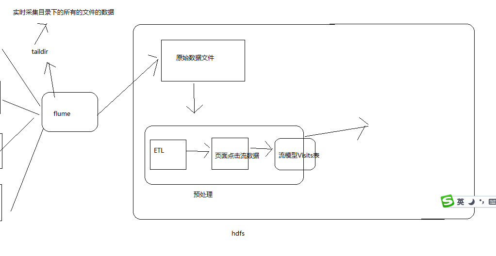
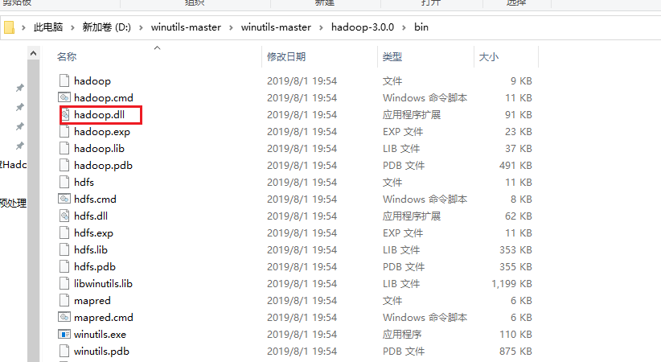
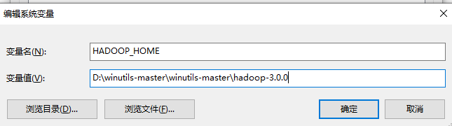

# 离线项目的预处理实现

# 一、项目架构

# 二、预处理需求

- 实现数据清洗（ETL）
- 生成页面点击流数据
- 生成流模型访问表

# 三、回顾mr如何实现

## 1、wc实例

- 配置pom文件

  ~~~ xml
  <?xml version="1.0" encoding="UTF-8"?>
  <project xmlns="http://maven.apache.org/POM/4.0.0"
           xmlns:xsi="http://www.w3.org/2001/XMLSchema-instance"
           xsi:schemaLocation="http://maven.apache.org/POM/4.0.0 http://maven.apache.org/xsd/maven-4.0.0.xsd">
      <modelVersion>4.0.0</modelVersion>
  
      <groupId>com.gec</groupId>
      <artifactId>wcdemo</artifactId>
      <version>1.0-SNAPSHOT</version>
  
      <properties>
          <slf4j.version>1.7.30</slf4j.version>
          <!--设置jdk1.8版本-->
          <maven.compiler.source>1.8</maven.compiler.source>
          <maven.compiler.target>1.8</maven.compiler.target>
      </properties>
  
      <dependencies>
          <dependency>
              <groupId>junit</groupId>
              <artifactId>junit</artifactId>
              <version>4.12</version>
          </dependency>
          <dependency>
              <groupId>org.apache.logging.log4j</groupId>
              <artifactId>log4j-slf4j-impl</artifactId>
              <version>2.12.0</version>
          </dependency>
          <dependency>
              <groupId>org.apache.hadoop</groupId>
              <artifactId>hadoop-client-api</artifactId>
              <version>3.1.3</version>
          </dependency>
          <dependency>
              <groupId>org.apache.hadoop</groupId>
              <artifactId>hadoop-client-runtime</artifactId>
              <version>3.1.3</version>
          </dependency>
      </dependencies>
  
  
  </project>
  ~~~

- 编写WcMapper

  ~~~ java
  package com.zhang.mapreduce.wordcount;
  
  import org.apache.hadoop.io.IntWritable;
  import org.apache.hadoop.io.LongWritable;
  import org.apache.hadoop.io.Text;
  import org.apache.hadoop.mapreduce.Mapper;
  
  import java.io.IOException;
  
  /*
  * KEYIN
  * VALUEIN
  * KEYOUT
  * VALUEOUT
  * */
  public class WcMapper extends Mapper<LongWritable, Text,Text, IntWritable> {
  
      Text k = new Text();
      IntWritable v = new IntWritable(1);
  
      @Override
      protected void map(LongWritable key, Text value, Context context) throws IOException, InterruptedException {
  
          // 1 获取一行
          String line = value.toString();
  
          // 2 切割
          String[] words = line.split(" ");
  
          // 3 输出
          for (String word : words) {
  
              k.set(word);
              context.write(k, v);
          }
      }
  }
  ~~~

- 编写WcReducer

  ~~~ java
  package com.gec.mapreduce.wordcount;
  
  import org.apache.hadoop.io.IntWritable;
  import org.apache.hadoop.io.Text;
  import org.apache.hadoop.mapreduce.Reducer;
  
  import java.io.IOException;
  
  public class WcReducer extends Reducer<Text, IntWritable, Text, IntWritable> {
  
      int sum;
      IntWritable v = new IntWritable();
  
      @Override
      protected void reduce(Text key, Iterable<IntWritable> values, Context context) throws IOException, InterruptedException {
  
          // 1 累加求和
          sum = 0;
          for (IntWritable value : values) {
  
              sum+=value.get();
          }
  
          // 2 输出
          v.set(sum);
          context.write(key,v);
  
      }
  }
  
  ~~~

- 在window平台直接运行mr

  

  - 配置HADOOP_HOME的环境变量

    

  - 编写WcDriver.java

    ~~~ java
    package com.gec.mapreduce.wordcount;
    
    import org.apache.hadoop.conf.Configuration;
    import org.apache.hadoop.fs.Path;
    import org.apache.hadoop.io.IntWritable;
    import org.apache.hadoop.io.Text;
    import org.apache.hadoop.mapreduce.Job;
    import org.apache.hadoop.mapreduce.lib.input.FileInputFormat;
    import org.apache.hadoop.mapreduce.lib.output.FileOutputFormat;
    
    import java.io.IOException;
    
    public class WcDriver {
    
        static {
            try {
                // 设置 HADOOP_HOME 目录
                System.setProperty("hadoop.home.dir", "D:/winutils-master/winutils-master/hadoop-3.0.0/");
                // 加载库文件
                System.load("D:/winutils-master/winutils-master/hadoop-3.0.0/bin/hadoop.dll");
            } catch (UnsatisfiedLinkError e) {
                System.err.println("Native code library failed to load.\n" + e);
                System.exit(1);
            }
        }
    
        public static void main(String[] args) throws IOException, ClassNotFoundException, InterruptedException {
    
            Configuration configuration = new Configuration();
            Job job = Job.getInstance(configuration);
    
            //执行mr的主类
            job.setJarByClass(WcDriver.class);
            // 3 设置map和reduce类
            job.setMapperClass(WcMapper.class);
            job.setReducerClass(WcReducer.class);
    
            // 4 设置map输出
            job.setMapOutputKeyClass(Text.class);
            job.setMapOutputValueClass(IntWritable.class);
    
            // 5 设置最终输出kv类型
            job.setOutputKeyClass(Text.class);
            job.setOutputValueClass(IntWritable.class);
    
            // 6 设置输入和输出路径
            FileInputFormat.setInputPaths(job, new Path("D:\\src\\wcinput\\"));
            FileOutputFormat.setOutputPath(job, new Path("D:\\src\\wcoutput"));
    
            // 7 提交
            boolean result = job.waitForCompletion(true);
    
            System.exit(result ? 0 : 1);
    
    
        }
    }
    
    ~~~

# 四、编写数据清洗的mr程序

## 1、需求

- 清洗条件
  - 响应状态码》=400
  - 无效时间
  - 访问无效页面
    - 例如静态资源

## 2、定义一个实体类描述源日志数据

~~~ java
package com.zhang.mr.pre.mrbean;

import org.apache.hadoop.io.Writable;

import java.io.DataInput;
import java.io.DataOutput;
import java.io.IOException;

/**
 * 对接外部数据的层，表结构定义最好跟外部数据源保持一致
 * 术语： 贴源表
 * @author
 *
 */
public class WebLogBean implements Writable {

    private boolean valid = true;// 判断数据是否合法
    private String remote_addr;// 记录客户端的ip地址
    private String remote_user;// 记录客户端用户名称,忽略属性"-"
    private String time_local;// 记录访问时间与时区
    private String request;// 记录请求的url与http协议
    private String status;// 记录请求状态；成功是200
    private String body_bytes_sent;// 记录发送给客户端文件主体内容大小
    private String http_referer;// 用来记录从那个页面链接访问过来的
    private String http_user_agent;// 记录客户浏览器的相关信息

    public void set(boolean valid,String remote_addr, String remote_user, String time_local, String request, String status, String body_bytes_sent, String http_referer, String http_user_agent) {
        this.valid = valid;
        this.remote_addr = remote_addr;
        this.remote_user = remote_user;
        this.time_local = time_local;
        this.request = request;
        this.status = status;
        this.body_bytes_sent = body_bytes_sent;
        this.http_referer = http_referer;
        this.http_user_agent = http_user_agent;
    }

    public String getRemote_addr() {
        return remote_addr;
    }

    public void setRemote_addr(String remote_addr) {
        this.remote_addr = remote_addr;
    }

    public String getRemote_user() {
        return remote_user;
    }

    public void setRemote_user(String remote_user) {
        this.remote_user = remote_user;
    }

    public String getTime_local() {
        return this.time_local;
    }

    public void setTime_local(String time_local) {
        this.time_local = time_local;
    }

    public String getRequest() {
        return request;
    }

    public void setRequest(String request) {
        this.request = request;
    }

    public String getStatus() {
        return status;
    }

    public void setStatus(String status) {
        this.status = status;
    }

    public String getBody_bytes_sent() {
        return body_bytes_sent;
    }

    public void setBody_bytes_sent(String body_bytes_sent) {
        this.body_bytes_sent = body_bytes_sent;
    }

    public String getHttp_referer() {
        return http_referer;
    }

    public void setHttp_referer(String http_referer) {
        this.http_referer = http_referer;
    }

    public String getHttp_user_agent() {
        return http_user_agent;
    }

    public void setHttp_user_agent(String http_user_agent) {
        this.http_user_agent = http_user_agent;
    }

    public boolean isValid() {
        return valid;
    }

    public void setValid(boolean valid) {
        this.valid = valid;
    }

    /**
     * \001是hive当中默认的分隔符，不会出现用户手打出来的情况
     * @return
     */
    @Override
    public String toString() {
        StringBuilder sb = new StringBuilder();
        sb.append(this.valid);
        sb.append("\001").append(this.getRemote_addr());
        sb.append("\001").append(this.getRemote_user());
        sb.append("\001").append(this.getTime_local());
        sb.append("\001").append(this.getRequest());
        sb.append("\001").append(this.getStatus());
        sb.append("\001").append(this.getBody_bytes_sent());
        sb.append("\001").append(this.getHttp_referer());
        sb.append("\001").append(this.getHttp_user_agent());
        return sb.toString();
    }

    @Override
    public void readFields(DataInput in) throws IOException {
        this.valid = in.readBoolean();
        this.remote_addr = in.readUTF();
        this.remote_user = in.readUTF();
        this.time_local = in.readUTF();
        this.request = in.readUTF();
        this.status = in.readUTF();
        this.body_bytes_sent = in.readUTF();
        this.http_referer = in.readUTF();
        this.http_user_agent = in.readUTF();

    }

    @Override
    public void write(DataOutput out) throws IOException {
        out.writeBoolean(this.valid);
        out.writeUTF(null==remote_addr?"":remote_addr);
        out.writeUTF(null==remote_user?"":remote_user);
        out.writeUTF(null==time_local?"":time_local);
        out.writeUTF(null==request?"":request);
        out.writeUTF(null==status?"":status);
        out.writeUTF(null==body_bytes_sent?"":body_bytes_sent);
        out.writeUTF(null==http_referer?"":http_referer);
        out.writeUTF(null==http_user_agent?"":http_user_agent);

    }

}
~~~

## 2、编写处理数据清洗的工具类

- WebLogParser
  - 将不符条件的数据，设置属性webLogBean.setValid(false);

~~~ java
package com.zhang.mr.pre.utils;

import com.gec.mr.pre.mrbean.WebLogBean;

import java.text.ParseException;
import java.text.SimpleDateFormat;
import java.util.Locale;
import java.util.Set;

public class WebLogParser {

    public static SimpleDateFormat df1 = new SimpleDateFormat("dd/MMM/yyyy:HH:mm:ss", Locale.US);
    public static SimpleDateFormat df2 = new SimpleDateFormat("yyyy-MM-dd HH:mm:ss", Locale.US);

    public static WebLogBean parser(String line) {
        WebLogBean webLogBean = new WebLogBean();
        //通过空格来对我们的数据进行切割，然后拼接字符串，将我们同一个字段里面的数据拼接到一起
        //222.66.59.174  -- [18/Sep/2013:06:53:30 +0000] "GET /images/my.jpg HTTP/1.1" 200 19939 "http://www.angularjs.cn/A00n" "Mozilla/5.0 (Windows NT 6.1; WOW64; rv:23.0) Gecko/20100101 Firefox/23.0"
        String[] arr = line.split(" ");
        if (arr.length > 11) {
            webLogBean.setRemote_addr(arr[0]);
            webLogBean.setRemote_user(arr[1]);
            //将我们的字符串转换成中文习惯的字符串
            //  [18/Sep/2013:06:52:32 +0000]
            //   18/Sep/2013:06:52:32------》2013-09-18 06:52:32
            String time_local = formatDate(arr[3].substring(1));
            if(null==time_local || "".equals(time_local)) {
                time_local="-invalid_time-";
            }

            webLogBean.setTime_local(time_local);
            webLogBean.setRequest(arr[6]);
            webLogBean.setStatus(arr[8]);
            webLogBean.setBody_bytes_sent(arr[9]);
            webLogBean.setHttp_referer(arr[10]);

            //如果useragent元素较多，拼接useragent。
            //数组长度大于12，说明我们的最后一个字段切出来比较长，我们把所有多的数据都塞到最后一个字段里面去
            //  "Mozilla/4.0 (compatible; MSIE 8.0; Windows NT 5.1; Trident/4.0; .NET CLR 1.1.4322; .NET CLR 2.0.50727; .NET CLR 3.0.04506.30; .NET CLR 3.0.4506.2152; .NET CLR 3.5.30729; MDDR; InfoPath.2; .NET4.0C)"
            if (arr.length > 12) {
                StringBuilder sb = new StringBuilder();
                for(int i=11;i<arr.length;i++){
                    sb.append(arr[i]);
                }
                webLogBean.setHttp_user_agent(sb.toString());
            } else {
                webLogBean.setHttp_user_agent(arr[11]);
            }
            //如果请求状态码大于400值，就认为是请求出错了，请求出错的数据直接认为是无效数据
            if (Integer.parseInt(webLogBean.getStatus()) >= 400) {// 大于400，HTTP错误
                webLogBean.setValid(false);
            }

            //如果获取时间没拿到，那么也是认为是无效的数据
            if("-invalid_time-".equals(webLogBean.getTime_local())){
                webLogBean.setValid(false);
            }
        } else {
            //58.215.204.118 - - [18/Sep/2013:06:52:33 +0000] "-" 400 0 "-" "-"
            //如果切出来的数组长度小于11个，说明数据不全，，直接丢掉
            webLogBean=null;
        }

        return webLogBean;
    }

    public static void filtStaticResource(WebLogBean bean, Set<String> pages) {
        if (!pages.contains(bean.getRequest())) {
            bean.setValid(false);
        }
    }
    //格式化时间方法
    public static String formatDate(String time_local) {
        try {
            return df2.format(df1.parse(time_local));
        } catch (ParseException e) {
            return null;
        }

    }

}

~~~

- 配置mr类
  - WeblogPreProcessMapper

~~~ java
package com.gec.mr.pre.mapper;

import com.gec.mr.pre.mrbean.WebLogBean;
import com.gec.mr.pre.utils.WebLogParser;
import org.apache.hadoop.io.LongWritable;
import org.apache.hadoop.io.NullWritable;
import org.apache.hadoop.io.Text;
import org.apache.hadoop.mapreduce.Mapper;

import java.io.IOException;
import java.util.HashSet;
import java.util.Set;

public class WeblogPreProcessMapper extends Mapper<LongWritable, Text, Text, NullWritable>
{
    // 用来存储网站url分类数据
    Set<String> pages = new HashSet<String>();
    Text k = new Text();
    NullWritable v = NullWritable.get();
    /**
     * map阶段的初始化方法
     * 从外部配置文件中加载网站的有用url分类数据 存储到maptask的内存中，用来对日志数据进行过滤
     * 过滤掉我们日志文件当中的一些静态资源，包括js   css  img  等请求日志都需要过滤掉
     */
    @Override
    protected void setup(Context context) throws IOException, InterruptedException {
        //定义一个集合
        pages.add("/about");
        pages.add("/black-ip-list/");
        pages.add("/cassandra-clustor/");
        pages.add("/finance-rhive-repurchase/");
        pages.add("/hadoop-family-roadmap/");
        pages.add("/hadoop-hive-intro/");
        pages.add("/hadoop-zookeeper-intro/");
        pages.add("/hadoop-mahout-roadmap/");

    }

    @Override
    protected void map(LongWritable key, Text value, Context context) throws IOException, InterruptedException {
        //得到我们一行数据
        String line = value.toString();
        WebLogBean webLogBean = WebLogParser.parser(line);
        if (webLogBean != null) {
            // 过滤js/图片/css等静态资源
            WebLogParser.filtStaticResource(webLogBean, pages);
            if (!webLogBean.isValid()) return;
            k.set(webLogBean.toString());
            context.write(k, v);
        }
    }
}

~~~

- 编写Driver

  ~~~ java
  package com.gec.mr.pre.driver;
  
  import com.gec.mr.pre.mapper.WeblogPreProcessMapper;
  import org.apache.hadoop.conf.Configuration;
  import org.apache.hadoop.fs.Path;
  import org.apache.hadoop.io.NullWritable;
  import org.apache.hadoop.io.Text;
  import org.apache.hadoop.mapreduce.Job;
  import org.apache.hadoop.mapreduce.lib.input.FileInputFormat;
  import org.apache.hadoop.mapreduce.lib.input.TextInputFormat;
  import org.apache.hadoop.mapreduce.lib.output.FileOutputFormat;
  import org.apache.hadoop.mapreduce.lib.output.TextOutputFormat;
  
  import java.io.IOException;
  
  public class WeblogEtlPreProcessDriver {
  
      static {
          try {
              // 设置 HADOOP_HOME 目录
              System.setProperty("hadoop.home.dir", "D:/winutils-master/winutils-master/hadoop-3.0.0/");
              // 加载库文件
              System.load("D:/winutils-master/winutils-master/hadoop-3.0.0/bin/hadoop.dll");
          } catch (UnsatisfiedLinkError e) {
              System.err.println("Native code library failed to load.\n" + e);
              System.exit(1);
          }
      }
  
  
      public static void main(String[] args) throws IOException, ClassNotFoundException, InterruptedException {
          Configuration configuration = new Configuration();
          Job job = Job.getInstance(configuration);
  
          FileInputFormat.addInputPath(job,new Path("file:///d:\\src\\input"));
          job.setInputFormatClass(TextInputFormat.class);
          FileOutputFormat.setOutputPath(job,new Path("file:///d:\\src\\weblogPreOut2"));
          job.setOutputFormatClass(TextOutputFormat.class);
          job.setJarByClass(WeblogEtlPreProcessDriver.class);
  
          job.setMapperClass(WeblogPreProcessMapper.class);
          job.setOutputKeyClass(Text.class);
          job.setOutputValueClass(NullWritable.class);
          job.setNumReduceTasks(0);
          boolean res = job.waitForCompletion(true);
      }
  }
  
  ~~~

  