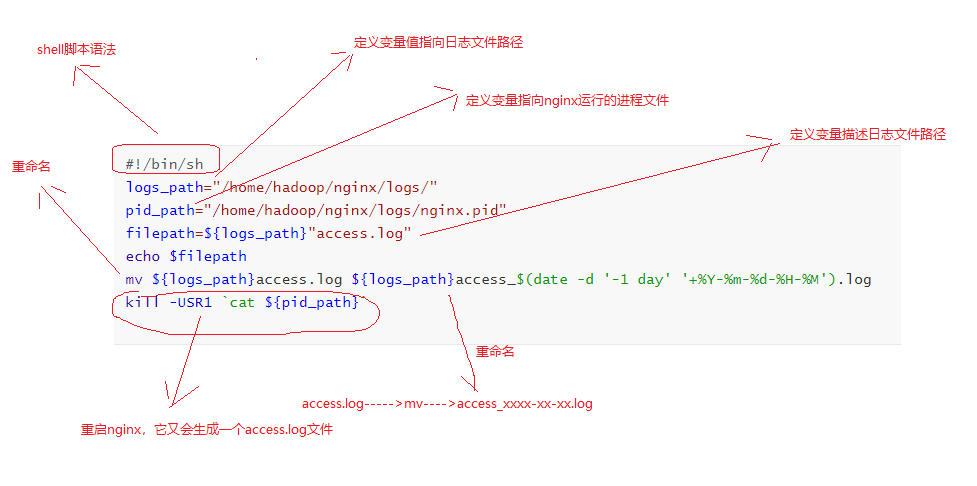

# 模块开发----数据采集

# 一、crontab

## 1、简介

- Linux crontab是用来定期执行程序的命令。当安装完成操作系统之后，默认便会启动此任务调度命令。crond 命令每分锺会定期检查是否有要执行的工作，如果有要执行的工作便会自动执行该工作。

## 2、功能组合

- 通过crontab 命令，我们可以在固定的间隔时间执行指定的系统指令或 shell script脚本。时间间隔的单位可以是分钟、小时、日、月、周及以上的任意组合。这个命令非常适合周期性的日志分析或数据备份等工作。

## 3、安装crontab

~~~ 
yum install crontabs
~~~

## 4、服务操作说明(root用户)

~~~ 
service crond start    ## 启动服务

service crond stop    ## 关闭服务

service crond restart   ## 重启服务

service crond reload  ## 重新载入配置

 

\## 查看crontab服务状态：

service crond status

 

\## 手动启动crontab服务：

service crond start

 

\## 查看crontab服务是否已设置为开机启动，执行命令：

chkconfig --list

 

\## 加入开机自动启动：

chkconfig --level 35 crond on

# 进入编辑指令
crontab -e
# 进入查看运行指令
crontab -l
# 删除指令
crontab -r
~~~

## 5、配置说明

~~~ 
基本格式 : 
*　　*　　*　　*　　*　　command 
分　 时　 日　 月　 周　 命令 
第1列表示分钟1～59 每分钟用*或者 */1表示 
第2列表示小时0～23（0表示0点） 7-9表示：8点到10点之间
第3列表示日期1～31 
第4列表示月份1～12 
第5列标识号星期0～6（0表示星期天） 
第6列要运行的命令 

~~~

## 6、例子

~~~ 
*/1 * * * * date >> /root/date.txt
上面的例子表示每分钟执行一次date命令
30 21 * * * /usr/local/etc/rc.d/httpd restart 
上面的例子表示每晚的21:30重启apache。 
45 4 1,10,22 * * /usr/local/etc/rc.d/httpd restart 
上面的例子表示每月1、10、22日的4 : 45重启apache。 
10 1 * * 6,0 /usr/local/etc/rc.d/httpd restart 
上面的例子表示每周六、周日的1 : 10重启apache。 
0,30 18-23 * * * /usr/local/etc/rc.d/httpd restart 
上面的例子表示在每天18 : 00至23 : 00之间每隔30分钟重启apache。 
0 23 * * 6 /usr/local/etc/rc.d/httpd restart 
上面的例子表示每星期六的11 : 00 pm重启apache。 
* */1 * * * /usr/local/etc/rc.d/httpd restart 
上面的例子每一小时重启apache 
* 23-7/1 * * * /usr/local/etc/rc.d/httpd restart 
上面的例子晚上11点到早上7点之间，每隔一小时重启apache 
0 11 4 * mon-wed /usr/local/etc/rc.d/httpd restart 
上面的例子每月的4号与每周一到周三的11点重启apache 
0 4 1 jan * /usr/local/etc/rc.d/httpd restart 
上面的例子一月一号的4点重启apache 

~~~

# 二、编写拆解日志文件脚本

~~~ sh
#!/bin/sh
logs_path="/home/hadoop/nginx/logs/"
pid_path="/home/hadoop/nginx/logs/nginx.pid"
filepath=${logs_path}"access.log"
echo $filepath
mv ${logs_path}access.log ${logs_path}access_$(date -d '-1 day' '+%Y-%m-%d-%H-%M').log
kill -USR1 `cat ${pid_path}`

~~~

- 输入crontab配置指令

~~~ 
*/1 * * * * sh /home/hadoop/bigdatasoftware/project1/nginx_log.sh
~~~

# 三、数据采集到hdfs

- flume1.7 新特性介绍 taildir 介绍
  
- flume1.7时新增了一个source 的类型为taildir,它可以监控一个目录下的多个文件，并且实现了实时读取记录保存的功能
  
- 新建配置文件

  ~~~ 
  touch job/TaildirSource-hdfs.conf
  ~~~

  

- 配置文件

  ~~~ properties
  agent1.sources = source1
  agent1.sinks = sink1
  agent1.channels = channel1
  #监控一个目录下的多个文件新增的内容
  agent1.sources.source1.type = TAILDIR
  #通过 json 格式存下每个文件消费的偏移量，避免从头消费
  agent1.sources.source1.positionFile = /home/hadoop/taildir_position.json
  agent1.sources.source1.filegroups = f1
  agent1.sources.source1.filegroups.f1 = /home/hadoop/nginx/logs/access_*.log
  
  agent1.sources.source1.interceptors = i1
  agent1.sources.source1.interceptors.i1.type = host
  agent1.sources.source1.interceptors.i1.hostHeader = hostname
  #配置sink组件为hdfs
  agent1.sinks.sink1.type = hdfs
  agent1.sinks.sink1.hdfs.path=hdfs://hadoop-001:8020/weblog/flume-collection/%Y-%m-%d/%H-%M_%{hostname}
  #指定文件名前缀
  agent1.sinks.sink1.hdfs.filePrefix = access_log
  #指定每批下沉数据的记录条数
  agent1.sinks.sink1.hdfs.batchSize= 100
  agent1.sinks.sink1.hdfs.fileType = DataStream
  agent1.sinks.sink1.hdfs.writeFormat =Text
  #指定下沉文件按1MB大小滚动
  agent1.sinks.sink1.hdfs.rollSize = 1048576
  #指定下沉文件按1000000条数滚动
  agent1.sinks.sink1.hdfs.rollCount = 1000000
  #指定下沉文件按30分钟滚动
  agent1.sinks.sink1.hdfs.rollInterval = 30
  #agent1.sinks.sink1.hdfs.round = true
  #agent1.sinks.sink1.hdfs.roundValue = 10
  #agent1.sinks.sink1.hdfs.roundUnit = minute
  agent1.sinks.sink1.hdfs.useLocalTimeStamp = true
  
  #使用memory类型channel
  agent1.channels.channel1.type = memory
  agent1.channels.channel1.capacity = 500000
  agent1.channels.channel1.transactionCapacity = 600
  
  # Bind the source and sink to the channel
  agent1.sources.source1.channels = channel1
  agent1.sinks.sink1.channel = channel1
  
  ~~~

- 运行脚本

  ~~~ properties
  bin/flume-ng agent --conf conf/ --name agent1 --conf-file job/TaildirSource-hdfs.conf -Dflume.root.logger=INFO,console
  ~~~

  

# 四、移动文件到预处理工作目录

- 

~~~ sh
#!/bin/bash

#
# ===========================================================================
# 程序名称:     
# 功能描述:     移动文件到预处理工作目录
# 输入参数:     运行日期
# 目标路径:     /data/weblog/preprocess/input
# 数据源  :     flume采集数据所存放的路径： /weblog/flume-collection
# 代码审核:     
# 修改人名:
# 修改日期:
# 修改原因:
# 修改列表: 
# ===========================================================================

#flume采集生成的日志文件存放的目录
log_flume_dir=/weblog/flume-collection

#预处理程序的工作目录
log_pre_input=/data/weblog/preprocess/input

#获取时间信息
day_01="2013-09-18"
day_01=`date -d'-1 day' +%Y-%m-%d`
syear=`date --date=$day_01 +%Y`
smonth=`date --date=$day_01 +%m`
sday=`date --date=$day_01 +%d`

#读取日志文件的目录，判断是否有需要上传的文件
files=`hadoop fs -ls $log_flume_dir | grep $day_01 | wc -l`
if [ $files -gt 0 ]; then
hadoop fs -mv ${log_flume_dir}/${day_01} ${log_pre_input}
echo "success moved ${log_flume_dir}/${day_01} to ${log_pre_input} ....."
fi

~~~

